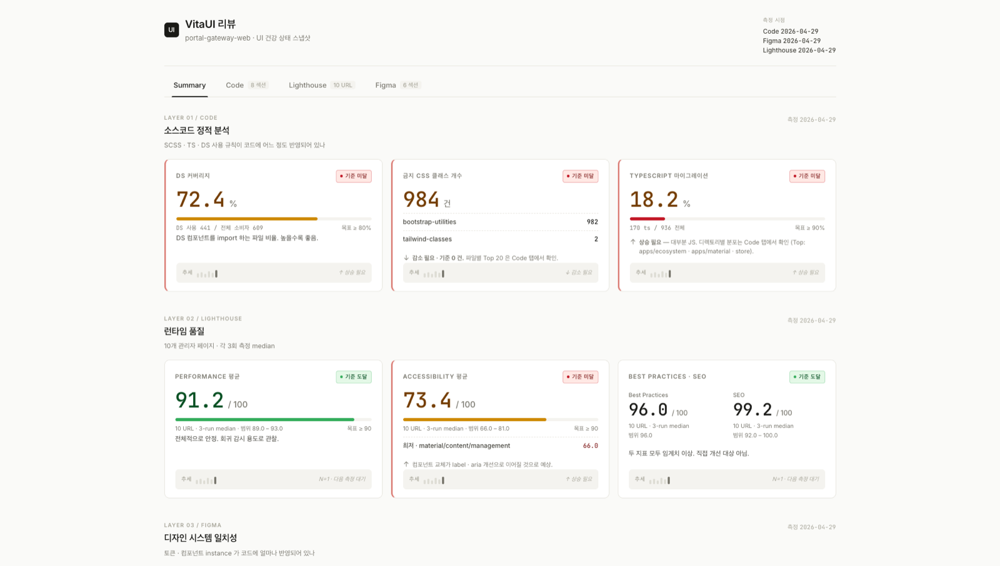

# DSMonitor

> UI Health Monitoring Framework — 코드베이스, 스타일, 디자인의 일관성을 정량으로 측정하는 도구입니다.
>
> UI Health Monitoring Framework — a tool that quantifies codebase, style, and design consistency.

DSMonitor 는 **측정 도구** 입니다 (개선 도구가 아닙니다). 분석 결과는 baseline JSON 과 markdown 리포트, 그리고 인터랙티브 대시보드로 출력됩니다.

> 이 문서는 한국어 정본을 먼저 두고 그 아래에 영어 정본을 둡니다. 두 정본은 같은 sub-section 순서로 1:1 대응됩니다. **English version is in the lower half of this file** (see [English](#english)).



## 목차 / Table of Contents

**처음이신가요? (기획 · 퍼블리싱 등 비개발자)** — [2. 설치](#2-설치) → [3. 빠른 시작](#3-빠른-시작) → [5. 출력물 위치](#5-출력물-위치) → [6. 보고서 활용](#6-보고서-활용-가이드) 네 곳만 순서대로 따라가면 한 바퀴 돌려볼 수 있습니다. 나머지는 필요할 때 찾아보면 됩니다.

**개발자 · 세부 설정** — 위에 더해 [7. 설정 가이드](#7-설정-가이드--dsmonitorconfigts-의-모든-필드) 이하 심화 레퍼런스까지 함께 보십시오.

| 시작하기 | 심화 레퍼런스 |
|----------|----------------|
| [지원 기술 스택](#지원-기술-스택--supported-tech-stacks) | [7. 설정 가이드](#7-설정-가이드--dsmonitorconfigts-의-모든-필드) |
| [1. 측정 항목](#1-측정-항목) | [8. 환경별 설정 예](#8-환경별-설정-예) |
| [2. 설치](#2-설치) | [9. Figma 매칭 동작 원리](#9-figma-매칭-동작-원리) |
| [3. 빠른 시작](#3-빠른-시작) | [10. ESLint plugin](#10-eslint-plugin) |
| [4. CLI 명령어](#4-cli-명령어) | [11. 사이드카 plugin](#11-사이드카-plugin) |
| [5. 출력물 위치](#5-출력물-위치) | [12. 환경변수](#12-환경변수) |
| [6. 보고서 활용](#6-보고서-활용-가이드) | [13. 트러블슈팅 / FAQ](#13-트러블슈팅--faq) |

## 지원 기술 스택 / Supported Tech Stacks

DSMonitor 는 다음 기술 스택 조합에서 사용 가능합니다. 신규 도입을 검토하는 단계에서 가장 먼저 이 표로 호환 여부를 확인하시면 됩니다.

| 분야                | 지원                                                                  |
|---------------------|----------------------------------------------------------------------|
| Framework (frontend) | React (Vue / Svelte 등 미지원)                                       |
| Meta-framework       | Next.js (App Router / Pages Router), Vite                            |
| Language             | TypeScript, JavaScript (`.ts`, `.tsx`, `.js`, `.jsx`)                 |
| Styling              | Tailwind, Bootstrap, SCSS, CSS Modules (preset 4종 제공)              |
| Design 통합          | Figma (선택)                                                          |
| Performance 측정     | Lighthouse (선택)                                                     |

위 조합에 해당하지 않는 환경 (예: Vue / Svelte 프로젝트) 은 본 시점 미지원이며, 호환성 검토는 별도로 진행이 필요합니다.

---

## 1. 측정 항목

DSMonitor 는 세 가지 항목을 측정합니다.

| 항목       | 분석 대상                                                                                                                                                  | 출력                                                              |
| ---------- | ---------------------------------------------------------------------------------------------------------------------------------------------------------- | ----------------------------------------------------------------- |
| code       | TS / JS / JSX / TSX 코드베이스의 정적 분석 (forbidden class, DS coverage, TS migration, 하드코딩 색상, SCSS 변수 준수율, 마이그레이션 후보, orphan class 등) | `dsmonitor/reports/baseline-*.json`, `dsmonitor/docs/baseline.md` |
| figma      | DS 파일의 Styles / Components 카운트, 도메인 파일 INSTANCE 의 출처 미상 비율, DS ↔ 코드 토큰 매트릭스, DS 컴포넌트 ↔ 코드 className 매칭                       | 위 JSON 의 `figma` 필드                                            |
| lighthouse | 페이지별 Performance / Accessibility / Best Practices / SEO 점수                                                                                            | `dsmonitor/lighthouse/reports/YYYY-MM-DD/`                        |

세 항목 가운데 code 만 필수입니다. figma 와 lighthouse 는 설정에서 빼면 대시보드에서도 자동으로 숨겨집니다.

## 2. 설치

**사전 조건** — Node.js 18 이상과 npm 이 필요합니다 ([nodejs.org](https://nodejs.org) 에서 LTS 설치). 아래 명령은 모두 **프로젝트 루트 폴더에서 연 터미널**(macOS 터미널, Windows 명령 프롬프트, VS Code 통합 터미널 등)에서 실행합니다.

```bash
npm install --save-dev dsmonitor
```

ESLint 규칙을 함께 사용하려면 wrapper 패키지 `eslint-plugin-dsmonitor` 도 함께 설치합니다. ESLint legacy 설정 (`.eslintrc.js`) 이 `eslint-plugin-{name}` 형식의 패키지를 자동으로 찾기 때문에 별도 패키지로 배포되고 있습니다.

```bash
npm install --save-dev dsmonitor eslint-plugin-dsmonitor
```

선택 의존성 (실제로 사용하는 경우에만 설치):

| 패키지                     | 설치 시점                                       | 명령                                                |
| -------------------------- | ----------------------------------------------- | --------------------------------------------------- |
| `eslint` >= 8              | dsmonitor ESLint 규칙을 사용하는 경우            | `npm install --save-dev eslint`                     |
| `eslint-plugin-dsmonitor`  | dsmonitor ESLint 규칙을 사용하는 경우            | `npm install --save-dev eslint-plugin-dsmonitor`    |
| `@lhci/cli` >= 0.13        | Lighthouse 측정을 사용하는 경우                  | `dsmonitor init` 실행 시 자동 설치                  |
| `typescript` >= 5.0        | `dsmonitor.config.ts` 를 직접 작성하는 경우      | 대개 이미 설치되어 있습니다                          |

## 3. 빠른 시작

> **비개발자 5분 시작** — 설정을 깊이 건드리지 않고 코드 항목만 빠르게 보고 싶다면:
>
> 1. `npx dsmonitor init` — Figma / Lighthouse 사용 여부를 묻습니다. 잘 모르겠으면 둘 다 `N` 으로 두면 됩니다 (나중에 켤 수 있습니다).
> 2. `npx dsmonitor audit --only code` — 코드 항목만 측정합니다 (Figma 토큰이나 로그인 설정 없이 바로 돌아갑니다).
> 3. 생성된 대시보드를 브라우저로 엽니다 — macOS 는 터미널에서 `open dsmonitor/reports/dashboard-*.html`, Windows 는 `start dsmonitor\reports\dashboard-*.html`, 또는 파일 탐색기에서 `dsmonitor/reports/` 폴더의 `dashboard-….html` 파일을 더블클릭합니다.
>
> Figma · Lighthouse 까지 포함한 설정은 아래 3.1 ~ 3.3 과 [7. 설정 가이드](#7-설정-가이드--dsmonitorconfigts-의-모든-필드) 에서 다룹니다.

### 3.1 부트스트랩 (`dsmonitor init`)

```bash
npx dsmonitor init
```

→ 인터랙티브 프롬프트로 다음을 묻습니다.

- Lighthouse 측정을 사용하시겠습니까? (Y 를 선택하면 `@lhci/cli` 가 자동 설치됩니다.)
- Figma 측정을 사용하시겠습니까? (Y 를 선택하면 설정 파일에서 관련 블록만 토큰 치환합니다.)

→ 자동으로 생성되는 파일:

- `dsmonitor/dsmonitor.config.ts` — 선택한 옵션에 맞춰 토큰이 치환된 설정 파일
- `dsmonitor/.env.local.example` — 환경변수 템플릿
- `dsmonitor/reports/.gitkeep` — 리포트 디렉토리 placeholder
- `dsmonitor/lighthouse/auth/custom.js` — Lighthouse 측정을 사용하고 custom 인증을 고른 경우에만 스켈레톤 생성

직접 디렉토리를 만들 때의 구조는 다음과 같습니다.

```
my-project/
└── dsmonitor/
    ├── dsmonitor.config.ts        ← presets 와 설정을 직접 작성합니다
    ├── .env.local                 ← gitignored. LIGHTHOUSE_* / FIGMA_API_TOKEN
    ├── .env.local.example
    ├── reports/                   ← 측정 결과 JSON 이 자동으로 출력됩니다
    └── lighthouse/                ← Lighthouse 측정을 사용하는 경우에만
        └── auth/custom.js         ← custom 인증 어댑터를 쓰는 경우에만
```

### 3.2 `.env.local` 작성

`.env.local.example` 의 키를 실제 값으로 채워서 `dsmonitor/.env.local` 로 복사합니다.

```bash
cp dsmonitor/.env.local.example dsmonitor/.env.local
# 편집기에서 열어 실제 값을 입력합니다.
```

| 변수                          | 인증 방식             | 용도                                                                                       |
| ----------------------------- | --------------------- | ------------------------------------------------------------------------------------------ |
| `FIGMA_API_TOKEN`             | —                     | Figma 측정을 사용할 때 필요합니다 (`figmaAnalysis = true`). Figma → Settings → Personal access tokens 에서 발급합니다. |
| `LIGHTHOUSE_BASE_URL`         | none / basic / custom | Lighthouse 측정 대상 base URL. dev / it / prod 환경을 전환할 때는 이 값 하나만 바꾸면 됩니다. |
| `LIGHTHOUSE_LOGIN_URL`        | basic                 | 로그인 페이지 경로 (예: `/login`) 또는 절대 URL.                                            |
| `LIGHTHOUSE_TEST_ID`          | basic                 | 테스트 계정 ID — basic 어댑터가 읽습니다.                                                   |
| `LIGHTHOUSE_TEST_PW`          | basic                 | 테스트 계정 비밀번호 — basic 어댑터가 읽습니다.                                             |
| `LIGHTHOUSE_BASIC_SELECTOR_*` | basic (선택)          | basic 어댑터의 기본 셀렉터를 덮어씁니다 — `ID_INPUT` / `PW_INPUT` / `SUBMIT` 세 가지.        |

- `.env.local` 은 `.gitignore` 에 반드시 추가하세요 (민감 정보).
- custom 어댑터를 사용하는 경우에는 변수를 자유롭게 정의해도 됩니다. 어댑터 본문에서 읽는 변수와 `.env.local.example` 의 안내 줄을 일치시켜 두면 다른 팀원이 알아보기 쉽습니다.

### 3.3 `dsmonitor.config.ts` 작성

`dsmonitor init` 으로 생성된 `dsmonitor/dsmonitor.config.ts` 에서 다음 항목을 환경에 맞게 채웁니다. 각 필드의 세부 의미는 아래 "설정 가이드" 항목에서 다룹니다.

- `projectRoot` — 보통 `..` 으로 둡니다 (`dsmonitor/` 폴더의 한 단계 위).
- `scan.codeRoots` / `scan.ignore` — 분석 대상 폴더와 제외 패턴.
- `figma.designSystemFiles` / `figma.domainFiles` — Figma file URL 을 그대로 입력합니다 (Figma 측정을 쓸 때).
- `lighthouse.baseUrl` / `lighthouse.pages` — Lighthouse 측정 대상 URL 과 페이지 목록.
- `lighthouse.auth` — 인증 방식 (none / basic / custom).

## 4. CLI 명령어

```bash
npx dsmonitor audit --all                    # 통합 측정 체인 (code + figma + lighthouse + report + dashboard)
npx dsmonitor audit --all --skip-lighthouse  # 빠른 통합 측정 (Lighthouse 만 건너뜀)
npx dsmonitor audit                          # code + figma 측정 (전체 사이클)
npx dsmonitor audit --only code              # code 만 측정
npx dsmonitor audit --only figma             # figma 만 측정 (기존 baseline JSON 을 base 로 사용)
npx dsmonitor audit --only lighthouse        # Lighthouse 만 측정
npx dsmonitor audit --baseline               # 정식 baseline 모드로 측정 (baseline-YYYY-MM-DD.json)
npx dsmonitor report                         # markdown 리포트만 재생성
npx dsmonitor dashboard                      # dashboard HTML 만 재빌드 (사이드카 plugin 자동 검색)
npx dsmonitor baseline-lint                  # ESLint forbidden class baseline 생성
npx dsmonitor doctor [--json] [--strict]     # 설정 / 환경변수 / path 진단 (0.7.0+)
npx dsmonitor export-migration --frame=<frame-comment> [--ds=<label>]  # Figma frame 안의 instance CSV 출력
```

공통 옵션:

- `--config <path>` — 설정 파일 경로를 명시합니다. 미지정 시 현재 디렉토리에서 위로 거슬러 올라가며 `dsmonitor.config.ts` 또는 `dsmonitor/dsmonitor.config.ts` 를 자동으로 찾습니다.
- `--env <path>` — `.env.local` 경로를 명시합니다. 미지정 시 설정 파일과 같은 디렉토리에서 찾습니다.
- `--input <path>` / `--output <path>` — `report` 명령에서 입력 / 출력 경로를 명시합니다.

### 4.1 측정 명령 비교

권장 패턴은 `package.json` 의 npm scripts 에 다음과 같이 정리해 두는 것입니다.

| 명령                                                          | baseline JSON 생성 | dashboard 갱신 | 사용 시점                                                                                              |
| ------------------------------------------------------------- | ------------------ | -------------- | ------------------------------------------------------------------------------------------------------ |
| `npx dsmonitor audit --all --baseline`                        | ✓                  | ✓              | **권장** — 한 번의 명령으로 code + figma + Lighthouse + report + dashboard 가 자동으로 이어집니다.        |
| `npx dsmonitor audit --all --baseline --skip-lighthouse`      | ✓                  | ✓              | 빠른 통합 측정 (Lighthouse 만 건너뜀, 약 1–2분).                                                         |
| `npx dsmonitor audit && dsmonitor report && dsmonitor dashboard` | ✗                  | ✓              | 옛 방식 — 빠르게 측정만 하고 대시보드를 새로 그리고 싶을 때.                                              |
| `npx dsmonitor audit --baseline && dsmonitor report && dsmonitor dashboard` | ✓ | ✓ | 옛 방식으로 baseline 을 갱신.                                                                            |
| `npx dsmonitor audit --only code`                             | ✗                  | ✗              | code 만 빠르게 측정.                                                                                    |
| `npx dsmonitor audit --only figma`                            | ✗                  | ✗              | figma raw (`figma-instances-{date}.json`) 만 생성. dashboard 에는 반영되지 않습니다.                     |
| `npx dsmonitor audit --only lighthouse`                       | ✗                  | ✓              | Lighthouse 만 측정 (약 25분 소요, dashboard 의 lighthouse 부분만 갱신).                                  |

- `audit --all` 은 v0.3.0 부터 추가된 통합 체인이며 가장 권장하는 흐름입니다. Lighthouse 사전 준비 (`.env.local` 의 `LIGHTHOUSE_*` 환경변수, 필요한 경우 custom 어댑터) 는 Lighthouse 를 사용할 때만 필요합니다.
- `dashboard` 는 가장 최근의 `baseline-*.json` (prefix 일치) 을 읽어 HTML 을 그립니다.
- 더 깊은 흐름 설명은 [docs/measurement-flow.md](./docs/measurement-flow.md) 에 있습니다.

### 4.2 `export-migration` 명령

```bash
npx dsmonitor export-migration --frame=<frame-comment> [--ds=<label>]
```

특정 Figma frame 안의 instance 단위 마이그레이션 작업 시 활용하는 CSV 를 출력합니다. 디자이너 또는 퍼블리셔가 작업 순서를 잡을 때 쓰는 흐름입니다.

| 항목                  | 내용                                                                                                                                                |
| --------------------- | --------------------------------------------------------------------------------------------------------------------------------------------------- |
| 동작                  | `figma-instances-{date}.json` 을 읽어서 frame / ds 필터링 + figmaUrl 자동 조립 후 CSV 로 출력합니다.                                                  |
| `--frame=<comment>`   | Figma frame 의 comment 또는 name 으로 필터링합니다 (예: `--frame=Test-Perform`). 정확 일치만 인정합니다.                                              |
| `--ds=<label>` (선택) | DS label 로 필터링합니다. 기본값은 `ds-legacy` 이며, `ds-new` / `unmatched` / `all` 도 지정할 수 있습니다.                                            |
| 사전 준비             | `npx dsmonitor audit --baseline` 으로 figma 측정이 끝나서 `dsmonitor/reports/figma-instances-{date}.json` 이 생성되어 있어야 합니다.                  |
| 출력                  | `dsmonitor/reports/migration/{frame}-{ds}-YYYY-MM-DD.csv` (frame 이름과 ds label 은 영문 / 숫자 / 하이픈 / 언더스코어 외 문자가 언더스코어로 치환됩니다). |
| CSV 컬럼              | `nodeId` / `componentName` / `instanceName` / `dsLabel` / `contextPath` / `figmaUrl` — figmaUrl 은 자동 조립되어 클릭으로 바로 진입할 수 있습니다.    |

## 5. 출력물 위치

| 파일                                                      | 내용                                                                                       |
| --------------------------------------------------------- | ----------------------------------------------------------------------------------------- |
| `dsmonitor/reports/baseline-YYYY-MM-DD.json`              | 측정 결과 (정식 baseline). `--baseline` 모드로 생성.                                        |
| `dsmonitor/reports/YYYY-MM-DD.json`                       | non-baseline (gitignored 권장).                                                            |
| `dsmonitor/reports/figma-instances-YYYY-MM-DD.json`       | Figma instance level raw — frame 별 nodeId / componentName / dsLabel / contextPath.       |
| `dsmonitor/reports/dashboard-YYYY-MM-DD.html`             | 5 탭 dashboard (Summary / Code / Lighthouse / Figma / Plugin — plugin 탭은 결과가 있을 때 동적 추가). 브라우저로 열어 확인합니다 (macOS `open …/dashboard-*.html`, Windows `start`, 또는 탐색기에서 더블클릭).                  |
| `dsmonitor/reports/migration/{frame}-{ds}-YYYY-MM-DD.csv` | 마이그레이션 CSV (`export-migration` 출력).                                                 |
| `dsmonitor/reports/plugins/{id}/{date}.json`              | 사이드카 plugin 의 측정 결과.                                                                |
| `dsmonitor/docs/baseline.md`                              | markdown 리포트 (자동 생성, 직접 수정 금지).                                                |
| `dsmonitor/docs/overview-for-stakeholders.md`             | 비개발자 시야의 간결 요약.                                                                  |
| `dsmonitor/lighthouse/reports/YYYY-MM-DD/manifest.json`   | LHCI manifest.                                                                            |
| `dsmonitor/lighthouse/reports/YYYY-MM-DD/summary.json`    | 페이지별 4점수 요약.                                                                       |
| `dsmonitor/lighthouse/reports/YYYY-MM-DD/*-report.html`   | 개별 Lighthouse HTML 리포트 (브라우저에서 열어 확인).                                       |

## 6. 보고서 활용 가이드

대시보드는 5개 탭으로 구성됩니다 (Figma / Lighthouse 가 꺼져 있으면 해당 탭은 숨겨집니다).

- **Summary** — 모든 지표의 한 화면 요약. 카드별로 good / warn / bad 색상이 적용됩니다.
- **Code** — 코드 측정 상세. forbidden class, DS coverage, TS migration, 마이그레이션 후보, orphan class 등.
- **Figma** — DS 카운트, 토큰 매트릭스, 출처 미상 instance, DS 컴포넌트 매칭, 마이그레이션 우선순위.
- **Lighthouse** — 페이지별 4점수와 추세.
- **Plugin** — `dsmonitor/reports/plugins/` 에 출력된 외부 측정 결과.

markdown 리포트 (`dsmonitor/docs/baseline.md`) 는 PR / 슬랙 / 사내 위키에 그대로 붙여 넣을 수 있는 형식입니다. 자동 생성이므로 직접 수정하지 마세요. 다음 측정 시 덮어씌워집니다.

비개발자(기획 · 디자인 · 퍼블리싱)라면 `dsmonitor/docs/overview-for-stakeholders.md` 부터 보십시오. 측정 결과를 코드 용어 없이 간결하게 요약한 문서입니다 (audit 실행 시 자동 생성).

---

> **여기부터는 심화 레퍼런스입니다.** `dsmonitor init` 이 이미 동작하는 설정 파일을 만들어 두므로, 처음이라면 아래를 전부 읽지 않아도 됩니다. 대개 경로나 URL 같은 값만 환경에 맞게 손보면 됩니다. §7 의 "(필수)" 표기는 "설정 파일에 그 항목이 있어야 한다"는 뜻이며, "직접 처음부터 써야 한다"는 뜻이 아닙니다.

## 7. 설정 가이드 — `dsmonitor.config.ts` 의 모든 필드

설정 파일 한 곳에서 모든 측정 옵션을 제어합니다. 아래는 `UIHealthConfig` 의 필드를 순서대로 정리한 것입니다.

### 7.1 `projectRoot` (필수)

분석 대상의 루트 경로입니다. 설정 파일이 `dsmonitor/dsmonitor.config.ts` 위치에 있으면 `..` 으로 두는 것이 자연스럽습니다.

```ts
projectRoot: "..",
```

### 7.2 `projectName` (선택)

대시보드 헤더와 푸터에 표시될 이름입니다. 비워 두면 `package.json` 의 `name` 을 읽어옵니다. 둘 다 없으면 `"Unknown Project"` 로 표시됩니다.

```ts
projectName: "MyProject",
```

### 7.3 `stylingPolicy` (필수)

프로젝트의 스타일링 정책 — 어떤 방식을 허용하고 (`allowed`), 어떤 방식을 권장하며 (`preferred`), 어떤 방식을 금지할지 (`forbidden`) 정의합니다. `presets/` 에 네 가지 기본 정책이 들어 있으니 가까운 것을 골라서 import 하면 됩니다 (0.7.3+ ESM 흐름).

```ts
import stylingPolicy from "dsmonitor/presets/scss-project.js";
// config 안:
//   stylingPolicy,
```

| preset                          | preferred  | allowed              | forbidden                              | 어울리는 프로젝트                                              |
| ------------------------------- | ---------- | -------------------- | -------------------------------------- | ------------------------------------------------------------ |
| `dsmonitor/presets/scss-project`        | scss       | SCSS / CSS imports   | Bootstrap utility / Tailwind utility   | CSS / SCSS 클래스 기반 스타일링 (.css / .scss 모두 포함). Bootstrap / Tailwind 잔재 정리 단계 활용. |
| `dsmonitor/presets/bootstrap-project`   | bootstrap  | Bootstrap (utility + component) | Tailwind / inline             | Bootstrap 우선.                                                |
| `dsmonitor/presets/tailwind-project`    | tailwind   | Tailwind utility     | Bootstrap / inline                     | Tailwind 우선.                                                 |
| `dsmonitor/presets/css-modules-project` | css-modules | CSS Modules import  | global utility                         | CSS Modules 로 모듈화 우선.                                    |

내 프로젝트에 딱 맞지 않을 때는 정책을 직접 작성할 수도 있습니다. 타입은 `import type { StylingPolicy } from "dsmonitor"` 로 가져옵니다.

### 7.4 `scan` (필수)

분석 대상과 제외 패턴을 정의합니다.

```ts
scan: {
  codeRoots: ["src", "components", "pages", "app"],
  styleRoots: ["src", "styles"],
  ignore: ["**/node_modules/**", "**/dist/**", "**/.next/**"],
  codeExts: [".ts", ".tsx", ".js", ".jsx"],
  styleExts: [".scss", ".css"],
},
```

- `codeRoots` — 코드 파일을 찾을 디렉토리. Next.js 의 Pages Router (`pages`) 와 App Router (`app`) 가 기본값에 모두 포함되어 있습니다.
- `styleRoots` — 스타일 파일을 찾을 디렉토리.
- `ignore` — glob 패턴으로 무시할 경로. CRA 환경이면 `**/build/**` 를, Vite 환경이면 `**/dist/**` 를 추가합니다.
- `codeExts` / `styleExts` — 확장자 목록. TS 전용 프로젝트면 `.js` / `.jsx` 를 빼도 됩니다.

### 7.5 `globalStyleSources` (필수)

전역으로 허용되는 스타일이 정의된 파일의 glob 패턴입니다. 이 패턴에 잡힌 파일에서 정의된 모든 CSS 셀렉터를 모아 "글로벌 인덱스" 를 만듭니다.

컴포넌트가 사용한 className 중 하나라도 글로벌 인덱스에 있으면 `allowedGlobal` 로, 하나도 없으면 `orphanClass` 로 분류됩니다.

```ts
globalStyleSources: ["styles/**/*.{scss,css}"],
```

### 7.6 `designSystem` (필수)

DS 컴포넌트가 어디에 있는지, 그리고 코드에서 DS 를 어떻게 import 하는지 두 가지를 함께 알려줍니다. `officialPaths` 와 `officialAliases` 는 같은 DS 를 서로 다른 "언어" 로 가리키며 보통 값이 다릅니다.

```ts
designSystem: {
  officialPaths: ["src/components/ds/**"],
  officialAliases: ["@ds/", "@/components/ds/"],
  componentExts: [".tsx", ".jsx"],
},
```

- `officialPaths` — DS 소스가 실제로 위치하는 파일 경로 (projectRoot 기준 glob). 이 경로 안 파일은 마이그레이션 후보 검출 대상에서 제외됩니다. 영향 지표는 `totals.dsComponentFiles` (DS 본체 파일 수) 입니다.
- `officialAliases` — 코드에서 DS 를 import 할 때 쓰는 alias prefix (tsconfig paths / webpack alias 등). 상대 경로 import 만 쓰는 환경이라면 빈 배열로 둬도 됩니다. 영향 지표는 `dsCoverage.filesUsingDs` / `dsCoverage.coverage` (DS 사용 비율) 입니다.
- `componentExts` — 컴포넌트 파일로 인정할 확장자.

두 필드의 값이 동일한 경우는 alias 가 없는 환경 (직접 경로 import 만 쓰는 경우) 입니다. 헷갈리지 않게 정리해 두면 `officialPaths` 는 "파일이 어디에 있나?", `officialAliases` 는 "import 가 어떻게 쓰이나?" 두 질문에 답한다고 생각하면 됩니다.

### 7.7 `hardcodedValues` (필수)

하드코딩된 값을 잡아내는 정규식 묶음입니다.

```ts
hardcodedValues: {
  colorPatterns: [
    /#[0-9a-fA-F]{3,8}\b/g,
    /\brgba?\s*\([^)]*\)/g,
    /\bhsla?\s*\([^)]*\)/g,
  ],
  scssVariableUsagePatterns: [
    /\bvar\s*\(\s*--[\w-]+/g,
    /\$[\w-]+/g,
  ],
  scssVariableDefFiles: [],
},
```

- `colorPatterns` — 하드코딩된 색상을 찾는 정규식.
- `scssVariableUsagePatterns` — 변수 참조를 찾는 정규식 (CSS `var()` + SCSS `$`).
- `scssVariableDefFiles` — 하드코딩 검출에서 제외할 변수 정의 원본 파일. Tailwind 환경에서 `app/globals.css` 의 `@theme` 색상이 noise 로 잡힐 때 여기에 넣어 둡니다.

### 7.8 `migrationTargets` / `migrationMinClassLength` (필수)

native HTML 태그를 어떤 DS 컴포넌트로 대체할지 매핑하는 표입니다. dsmonitor 는 이 표를 보고 "native 태그가 그대로 쓰이는 자리" 중 마이그레이션 후보를 추출합니다.

```ts
migrationTargets: {
  Button: {
    aliases: ["@/components/ds/Button"],
    nativeTags: ["button"],
  },
  Input: {
    aliases: ["@/components/ds/Input"],
    // 일반 텍스트 / 숫자 input 은 type 무관 매칭 (모든 <input>).
    nativeTags: ["input", "textarea"],
  },
  // 0.6.0 (W): input[type=...] 같은 attribute 매칭을 위해 객체 형식도 허용합니다.
  Checkbox: {
    aliases: ["@/components/ds/Checkbox"],
    nativeTags: [{ tag: "input", type: "checkbox" }],
  },
  Radio: {
    aliases: ["@/components/ds/Radio"],
    nativeTags: [{ tag: "input", type: "radio" }],
  },
  Switch: {
    aliases: ["@/components/ds/Switch"],
    nativeTags: [{ tag: "input", type: "checkbox" }],
  },
},
migrationMinClassLength: 3,
```

- key (예: `Button`) — 리포트와 대시보드에 표시되는 이름. 보통 컴포넌트 파일명이나 named import 이름과 같게 적습니다.
- `aliases` — 해당 컴포넌트의 import 경로 (또는 그 prefix). 0.6.1 부터는 alias 가 일치하는 import 중에서도 **named import 이름이 key 와 정확히 같을 때만** 해당 컴포넌트를 "이미 사용 중" 으로 인정합니다. 예를 들어 `import { Button } from "@/laon-web-ui"` 만 있는 파일에서 `<input>` 을 발견하면, Button 은 후보에서 제외되지만 Input 은 마이그레이션 후보로 잡힙니다. namespace import (`import * as Ui from "..."`) 와 default import 는 어느 컴포넌트인지 정확히 알 수 없어 옛 동작 (alias 매칭만으로 후보 제외) 을 그대로 유지합니다.
- `nativeTags` — 이 컴포넌트로 대체 가능한 native HTML 태그 목록입니다. 두 가지 형식을 함께 쓸 수 있습니다.
  - **string 형식** (예: `"button"`) — tag 이름만 비교합니다. type attribute 와 무관하게 매칭됩니다.
  - **객체 형식** (예: `{ tag: "input", type: "checkbox" }`, 0.6.0+) — tag 이름이 같고 `type` 도 정확히 일치할 때만 매칭됩니다. `<input type="checkbox">` 만 잡고 일반 `<input type="text">` 는 잡지 않으려는 경우에 사용합니다. `type` 을 생략하면 string 형식과 동일하게 동작합니다.
- `migrationMinClassLength` — 이 길이 미만의 className 은 후보에서 제외됩니다. 기본값 3 이면 `btn`, `nav` 같은 짧은 클래스는 포함되고, 4 로 올리면 더 보수적으로 줄어듭니다.

> 옛 `nativeTags: ["input"]` 형식 (0.5.x 까지) 의 설정은 0.6.0 에서도 그대로 작동합니다. 검출 결과의 의미를 바꾸지 않은 호환 변경입니다.

#### 7.8.1 `migrationCandidates.excludeOfficialPaths` (0.7.2+)

DS 본체 안에서 자연스럽게 쓰이는 native HTML (예: `Button.tsx` 가 내부에서 `<button>` 을 사용하는 케이스) 이 마이그레이션 후보로 잘못 잡히는 false positive 를 정정하는 옵션입니다.

```ts
migrationCandidates: {
  excludeOfficialPaths: true, // default (0.7.2+)
},
```

- **`true` (default)** — `designSystem.officialPaths` 에 매치되는 파일을 마이그레이션 후보 검출에서 자동 제외합니다. `scan.ignore` 에 DS 폴더를 따로 추가하지 않아도 됩니다. 0.7.2 부터 옛 prefix 매칭이 glob-aware 매칭으로 정정되어 `["src/laon-web-ui/**"]` 같은 glob 표기도 의도대로 동작합니다.
- **`false`** — 0.7.1 까지의 옛 동작입니다. `officialPaths` 안 파일도 후보 검출 대상에 들어갑니다. DS 본체 자체의 native HTML 패턴을 그대로 보고 싶을 때만 사용하세요.

`scan.ignore` 와의 차이:

| 옵션                                                  | 영향 범위                                   |
| ----------------------------------------------------- | ------------------------------------------ |
| `scan.ignore`                                         | 모든 측정에서 제외 — 파일 walk 자체에서 건너뜀. |
| `migrationCandidates.excludeOfficialPaths`            | 마이그레이션 후보 검출에서만 제외. `totals.dsComponentFiles` 같은 DS 본체 지표는 계속 잡힙니다. |

> 0.7.1 까지 `officialPaths: ["src/laon-web-ui/**"]` 처럼 glob 표기를 적은 환경에서는 매칭이 항상 실패해서 DS 본체 파일이 후보로 잡혔습니다. 0.7.2 부터 본 글로브 표기도 자연스럽게 인식되며 default `true` 가 함께 적용됩니다 — 따라서 옛 후보 숫자가 줄어들 수 있습니다 (의도된 정정). 옛 동작이 필요하면 `excludeOfficialPaths: false` 로 명시하세요.

### 7.9 `framework` (필수)

코드 분석에 사용할 framework 어댑터를 고릅니다. 현재는 `"react"` 만 지원합니다 (Vue / Svelte 어댑터는 향후 추가 예정).

```ts
framework: { id: "react" },
```

### 7.10 `metrics` (필수)

지표별 on / off 토글입니다. 프로젝트 상황에 맞지 않는 지표는 `false` 로 두면 대시보드에서도 숨겨집니다.

```ts
metrics: {
  tsMigration: true,
  dsCoverage: true,
  migrationCandidates: true,
  stylingDistribution: true,
  hardcodedColors: true,
  scssVariableCompliance: true,
  figmaAnalysis: false,
},
```

- `tsMigration` — TS / JS 비율을 잽니다. 순수 TS 프로젝트면 `false` 가 자연스럽습니다.
- `dsCoverage` — DS 컴포넌트를 사용하는 파일 비율.
- `migrationCandidates` — `migrationTargets` 표를 활용한 마이그레이션 후보 검출.
- `stylingDistribution` — 스타일링 방식 분포 (allowed / forbidden / preferred 비율).
- `hardcodedColors` — 하드코딩된 색상 카운트.
- `scssVariableCompliance` — SCSS 변수 사용 / 하드코딩 비율. Tailwind 환경에서는 변수 사용이 0 에 가까워 의미가 없으므로 `false` 권장.
- `figmaAnalysis` — Figma 측정 on / off. `true` 로 두려면 `figma` 필드와 `FIGMA_API_TOKEN` 환경변수가 함께 필요합니다.

### 7.11 `figma` (선택)

Figma 측정 설정입니다. `metrics.figmaAnalysis = true` 일 때만 실제로 사용됩니다.

```ts
figma: {
  validationLevel: "lite",
  designSystemFiles: [
    {
      url: "https://www.figma.com/design/AAAAA/Design-System",
      label: "ds-new",
      primary: true,
    },
  ],
  domainFiles: [
    {
      label: "domain-a",
      pages: [
        { url: "https://www.figma.com/design/BBBBB/Domain-A?node-id=2-2", comment: "계정관리" },
      ],
    },
  ],
  unknownInstances: {
    topN: 20,
    allowUnknownSource: true,
  },
  codeTokens: {
    parsers: [
      { type: "scss", files: ["styles/tokens.scss"] },
      // 0.6.0 (R): 신규 파서 2종.
      // Tailwind v3 (config 기반) — tailwind.config.{js,ts} 의 theme 토큰 추출.
      { type: "tailwind", config: "tailwind.config.ts" },
      // CSS variables — `--*` 정의가 들어 있는 CSS 파일. Tailwind v4 의
      // `@theme { --color-primary-500: ...; }` 도 본 파서로 커버됩니다.
      { type: "cssVariables", files: ["src/app/globals.css"] },
    ],
  },
},
```

- `validationLevel` — 현재는 `"lite"` 만 지원합니다. Variables API 는 Enterprise plan 이 있어야 호출 가능하기 때문에 Styles + Components 카운트만 측정합니다.
- `designSystemFiles` — DS 파일 목록. 각 항목은 `{ url, label, primary?, comment? }` 형태로 적습니다. DS 가 2개 이상이면 정확히 1개에 `primary: true` 가 필수입니다 (상세 규칙은 7.11.1 참고).
- `domainFiles` — 실제 UI 시안 파일 목록. 패턴 A / B / C 세 가지로 작성할 수 있습니다 (7.11.2 참고).
- `unknownInstances.topN` — "출처 미상 Instance" 상위 몇 개까지 노출할지.
- `unknownInstances.allowUnknownSource` — 외주 옛 DS 등 미등록 출처도 결과에 포함할지.
- `codeTokens.parsers` — 코드 토큰 파서 설정 배열입니다. 빈 배열로 두면 토큰 매트릭스의 code 컬럼 카운트가 0 으로 잡힙니다. 지원 파서는 다음 세 가지입니다 (필요한 만큼 함께 등록할 수 있습니다).
  - `{ type: "scss", files: [...] }` — SCSS / CSS 변수 + SCSS map + `@each` 동적 emit. `:root { --name: value; }` 형식과 SCSS map (`$light-theme: (...)` + `@each ... in $map`) 두 가지 모두 처리합니다.
  - `{ type: "cssVariables", files: [...] }` (0.6.0+) — 순수 CSS 파일의 `--*` 정의만 추출합니다. selector (`:root`, `.dark`, `[data-theme=...]`) 안에 있든 밖에 있든 동일하게 잡습니다. Tailwind v4 의 `@theme {...}` 디렉티브도 본 파서로 커버됩니다.
  - `{ type: "tailwind", config: "...", categories?: [...] }` (0.6.0+) — Tailwind v3 의 `tailwind.config.{js,cjs,mjs,ts}` 를 동적 import 해 `theme` / `theme.extend` 의 nested 값을 dot-path 로 flatten 합니다 (예: `colors.primary.500`, `spacing.4`). `categories` 를 생략하면 `["colors", "spacing", "fontSize", "borderRadius"]` 가 기본값입니다. 빈 배열을 넘기면 `theme` 의 모든 top-level 키를 시도합니다.

서로 다른 파서에서 동일한 이름이 나오면 등록 순서가 빠른 쪽이 우선이며, 이후 등장은 무시됩니다 (code 컬럼 카운트는 항상 0 또는 1).

**자동 감지와 진단 (0.7.0+)**

- `dsmonitor init` 은 cwd 기준으로 흔한 path 들을 탐색해 default 를 채워 줍니다. 감지된 경우 활성 entry, 감지 0건이면 4종 / 4위치를 주석으로 노출하므로 한 줄만 풀어 쓰면 됩니다.

| 항목         | 후보 (순서대로 첫 발견되는 파일이 default) |
|--------------|----------------------------------------------|
| Tailwind config | `tailwind.config.ts` / `tailwind.config.js` / `tailwind.config.mjs` / `tailwind.config.cjs` |
| globals.css     | `src/app/globals.css` / `src/styles/globals.css` / `app/globals.css` / `styles/globals.css` / `src/index.css` / `src/styles/main.css` |
| SCSS tokens     | `styles/tokens.scss` / `src/styles/tokens.scss` / `styles/variables.scss` / `src/styles/variables.scss` |

- audit 실행 시 지정한 path 가 파일시스템에 없으면 `⚠ codeTokens.parsers (...) — file_not_found` 한 줄이 stderr 로 emit 되고, baseline JSON 의 `figma.tokenMatrix.warnings` 에 누적되며, dashboard 의 토큰 매트릭스 sub-section 헤더에 노란 배너로 표시됩니다.
- 일괄 진단은 `npx dsmonitor doctor` — config / 환경변수 / 모든 path 를 한 번에 점검합니다.

#### 7.11.1 DS 파일 라벨과 primary

라벨은 자유 결정입니다 (`"v1"`, `"v2"`, `"main"`, `"legacy"`, `"ds-new"` 등). 대시보드는 사용자가 정한 라벨을 그대로 보여줍니다.

| 상태                              | 처리                |
| --------------------------------- | ------------------- |
| DS 1개 (primary 생략)              | 자동 primary        |
| DS 2개 이상 + primary 0개          | 에러 throw           |
| DS 2개 이상 + primary 1개          | 정상                |
| DS 2개 이상 + primary 2개 이상      | 에러 throw           |

0.1.x 까지는 `ds-new` 라벨이 자동으로 primary 였습니다. 0.2.0 부터는 명시 필수입니다.

```diff
- { url: "...", label: "ds-new" },
+ { url: "...", label: "ds-new", primary: true },
```

#### 7.11.2 도메인 파일 입력 패턴

도메인 파일은 세 가지 패턴 중 어느 것으로든 적을 수 있고, 한 도메인 안에서 패턴 B 와 C 를 섞어도 됩니다 (모든 URL 이 같은 file 에 속하는지 자동으로 검증합니다).

```ts
// 패턴 A — 파일 전체 측정 (archive 페이지가 섞여 있지 않을 때 적합)
{
  label: "domain-a",
  url: "https://www.figma.com/design/AAAAA/Domain-A",
  comment: "파일 전체 측정",
}

// 패턴 B — 특정 페이지 전체 측정
{
  label: "domain-b",
  pages: [
    { url: "https://www.figma.com/design/BBBBB/Domain-B?node-id=2-2", comment: "계정관리" },
    { url: "https://www.figma.com/design/BBBBB/Domain-B?node-id=3-1", comment: "권한설정" },
  ],
}

// 패턴 C — 페이지 안의 특정 frame 만 측정
{
  label: "domain-c",
  pages: [
    {
      comment: "대시보드",
      frames: [
        { url: "https://www.figma.com/design/CCCCC/Domain-C?node-id=100-5", comment: "메인위젯" },
        { url: "https://www.figma.com/design/CCCCC/Domain-C?node-id=100-10", comment: "상단요약" },
      ],
    },
  ],
}
```

URL 은 Figma 의 "Copy link" 결과를 그대로 붙여 넣으면 됩니다. fileKey 를 손으로 추출할 필요가 없고, URL 안의 `node-id=2-2` 와 REST API 의 `2:2` 사이 변환도 도구가 알아서 처리합니다.

### 7.12 `lighthouse` (선택)

Lighthouse 측정 설정입니다.

```ts
lighthouse: {
  baseUrl: process.env.LIGHTHOUSE_BASE_URL ?? "http://localhost:3000",
  pages: [
    { path: "/", name: "Home" },
    { path: "/dashboard", name: "Dashboard" },
  ],
  runs: 3,
  auth: { type: "none" },
  advanced: {
    settings: { skipAudits: ["uses-http2"] },
  },
},
```

- `baseUrl` — 측정 대상의 base URL. 환경을 전환할 때는 이 값 하나만 바꾸면 됩니다. 미지정 시 `process.env.LIGHTHOUSE_BASE_URL ?? "http://localhost:3000"` 가 fallback 입니다.
- `pages` — 측정 대상 페이지 목록. 각 항목은 `{ path, name? }`. 빈 배열이면 `["/"]` 가 fallback 입니다.
- `runs` — URL 1개당 측정 반복 수. 기본값 3 (대표값을 median 으로 뽑기 위함). 1 로 두면 빠르지만 대표성이 약해집니다.
- `auth` — 인증 방식. 상세 옵션은 7.12.1 참고.
- `advanced` — LHCI `ci.collect.settings` 에 deep-merge 되는 untyped passthrough. 흔한 활용 예:
  - `skipAudits: ["uses-http2"]` — 사내망에서 자주 빼는 옵션.
  - `chromeFlags: ["--no-sandbox"]` — Docker / CI 환경.
  - `throttlingMethod: "provided"` — 외부 throttle 을 쓰는 경우.
  - `screenEmulation: { ... }` — mobile / 다른 viewport.
  - `formFactor: "mobile"` — 기본 desktop 을 모바일로 전환.

기본 LHCI 옵션은 dsmonitor 가 다음 값들을 하드코딩으로 inject 합니다 (overrides 는 `advanced` 로 가능합니다).

- `preset: "desktop"` / `formFactor: "desktop"` / `screenEmulation: 1350×940`
- `onlyCategories: ["performance", "accessibility", "best-practices", "seo"]`
- `disableStorageReset` 은 `auth.type !== "none"` 일 때 자동으로 `true` 가 됩니다 (어댑터가 심은 세션 / JWT 가 측정 사이에 유지되도록).

#### 7.12.1 Lighthouse 인증 방식

`lighthouse.auth` 는 세 가지 중 하나를 고르는 discriminated union 입니다.

```ts
// 1. 인증 없음 — 공개 사이트
auth: { type: "none" }

// 2. ID / PW form login — dsmonitor 내장 어댑터
auth: {
  type: "basic",
  loginUrl: "/login",
  selectors: {
    idInput: "input[type='email']",   // 기본 추론 — 명시 시 우선
    pwInput: "input[type='password']",
    submit: "button[type='submit']",
  },
}

// 3. custom 어댑터 — 자유 본문
auth: {
  type: "custom",
  adapter: "./lighthouse/auth/custom.js",
}
```

- **none** — `LIGHTHOUSE_BASE_URL` 만 필요합니다. 로그인 단계 없이 바로 측정합니다.
- **basic** — dsmonitor 가 함께 배포하는 `lighthouse/auth/basic-form-login.js` 를 사용합니다. 환경변수로 `LIGHTHOUSE_LOGIN_URL` / `LIGHTHOUSE_TEST_ID` / `LIGHTHOUSE_TEST_PW` 를 읽고, selector 는 자동 추론합니다. 사이트 DOM 이 다르면 `LIGHTHOUSE_BASIC_SELECTOR_ID_INPUT` 등 환경변수로 덮어쓰거나 `selectors` 필드에 직접 적으면 됩니다.
- **custom** — 다단계 인증, OAuth, 세션 쿠키 복원 등 자유 흐름이 필요할 때 씁니다. `dsmonitor init` 에서 custom 을 고르면 `lighthouse/auth/custom.js` 스켈레톤이 자동 생성됩니다.

custom 어댑터 인터페이스 (LHCI `puppeteerScript` 호환 + dsmonitor 확장):

```js
// 필수 — LHCI 호환 (각 측정 URL 진입 전에 호출됨)
module.exports = async (browser, context) => {
  // 로그인 / 세션 복원 / 헤더 주입 등 자유 본문
};

// 선택 — summary.json 에 메타데이터 추가 (run.js 가 require 후 호출)
module.exports.getMetadata = () => ({
  authType: "custom",
  testAccount: process.env.LIGHTHOUSE_TEST_ID || null,
  // 자유 필드
});
```

`auth.type !== "none"` 이면 dsmonitor 가 자동으로 `disableStorageReset: true` 를 넣어 주므로 어댑터가 심은 세션은 페이지 사이에 보존됩니다.

**TypeScript 어댑터 작성 (0.7.1+)** — dsmonitor 가 export 하는 `LighthouseAuthAdapter` 타입을 활용하면 IDE 자동 완성과 컴파일 타임 검증을 함께 받을 수 있습니다. puppeteer 의 `Browser` 타입은 사용자 쪽에서 직접 import 합니다 (dsmonitor 는 puppeteer 를 직접 의존하지 않습니다).

```ts
import type { LighthouseAuthAdapter } from "dsmonitor";
import type { Browser } from "puppeteer";

const adapter: LighthouseAuthAdapter<Browser> = async (browser, context) => {
  const pages = await browser.pages();
  const page = pages.length > 0 ? pages[0] : await browser.newPage();
  // 로그인 / 토큰 주입 등 자유 본문.
};

adapter.getMetadata = () => ({ authType: "custom" });

export default adapter;
```

**흔한 인증 시나리오와 예제 (0.7.1+)** — `docs/auth-adapter-examples/` 에 그대로 복사해서 쓸 수 있는 어댑터 예제가 5종 들어 있습니다.

| 시나리오                  | 예제 파일                                                                      | 핵심                                              |
| ------------------------- | ------------------------------------------------------------------------------ | -------------------------------------------------- |
| HTTP Basic Authentication | [`01-basic-auth.ts`](./docs/auth-adapter-examples/01-basic-auth.ts)             | `page.authenticate()` 한 줄로 끝.                  |
| Form login (ID / PW)      | [`02-form-login.ts`](./docs/auth-adapter-examples/02-form-login.ts)             | 가장 흔한 패턴 — selector 만 정정하면 작동.        |
| SSO (외부 IdP redirect)   | [`03-sso.ts`](./docs/auth-adapter-examples/03-sso.ts)                           | IdP 도메인 redirect chain 추적.                    |
| JWT 토큰 주입              | [`04-jwt-persistence.ts`](./docs/auth-adapter-examples/04-jwt-persistence.ts)   | 로그인 페이지 건너뛰고 localStorage / cookie 주입. |
| OAuth 2.0 code flow       | [`05-oauth.ts`](./docs/auth-adapter-examples/05-oauth.ts)                       | authorize → 자격 증명 → consent → redirect_uri.    |

전체 안내 (작성 흐름 / 환경변수 패턴 / TypeScript → JavaScript 변환 / `dsmonitor doctor` 로 검증) 는 [`docs/auth-adapter-examples/README.md`](./docs/auth-adapter-examples/README.md) 에 있습니다.

### 7.13 `thresholds` (필수)

각 지표의 good / warn 임계값입니다. `direction` 이 `"higher"` 면 값이 높을수록 좋고, `"lower"` 면 낮을수록 좋습니다.

```ts
thresholds: {
  dsCoverage: { good: 0.8, warn: 0.5, direction: "higher" },
  tsMigration: { good: 0.7, warn: 0.3, direction: "higher" },
  scssVariableCompliance: { good: 0.9, warn: 0.7, direction: "higher" },
  preferredCompliance: { good: 0.8, warn: 0.5, direction: "higher" },
  hardcodedColors: { good: 20, warn: 50, direction: "lower" },
  forbiddenClassOccurrences: { good: 100, warn: 500, direction: "lower" },
  forbiddenFileRatio: { good: 0.1, warn: 0.3, direction: "lower" },
  componentMatch: { good: 0.7, warn: 0.4, direction: "higher" },
},
```

`componentMatch` 는 Figma DS 컴포넌트 ↔ 코드 className 매칭률에 대한 임계값입니다 (선택, Figma 측정을 쓸 때만 의미).

### 7.14 `softBaseline` (선택)

ESLint forbidden class 의 soft baseline 을 가시화하는 기능입니다. CI 를 막지 않는 대신, 현재 위반 수를 baseline 과 비교해 출력만 합니다.

```ts
softBaseline: {
  path: "lint-baseline.json",
},
```

- `path` — soft baseline JSON 파일의 경로 (설정 파일 기준).
- 파일이 없으면 "baseline 없음" 메시지만 찍고 종료합니다 (신규 프로젝트 대비).
- 이 파일은 `dsmonitor/eslint` 가 사용하는 `lint-baseline.json` (파일별 심각도 오버라이드) 과는 **다른 파일** 입니다. 헷갈리지 마세요.

### 7.15 `report` (필수)

baseline JSON 의 출력 위치와 prefix 입니다.

```ts
report: {
  outputDir: "reports",
  baselineFilenamePrefix: "baseline-",
},
```

### 7.16 `measurementHistory` / `reportStatus` (선택)

리포트의 시계열 해석을 돕기 위한 메타데이터입니다.

```ts
measurementHistory: [
  {
    version: "v0.3.2",
    date: "2026-05-11",
    summary: "README export-migration sub-section 신규 추가",
    notes: [
      "동작 / --frame / --ds flag 사양 정리.",
      "코드 변경 0건.",
    ],
  },
],

reportStatus: {
  completedPhases: [
    { name: "Phase 0.5", completedAt: "2026-05-14", note: "최소 측정 완료" },
  ],
  currentPhase: { name: "Phase 0.6", note: "호환성 검증", startedAt: "2026-05-15" },
  upcomingPhases: [
    { name: "Phase B", note: "Variables / Auto-layout" },
  ],
},
```

- `measurementHistory` — 측정 도구 자체의 변경 이력. 분석 로직이 바뀌어 과거 수치가 재해석될 필요가 있을 때 기록해 두면, 리포트 하단에서 독자가 "왜 이 숫자가 이만큼 바뀌었는지" 를 추적할 수 있습니다.
- `reportStatus` — 진행 단계 배지. baseline.md 상단에 렌더링됩니다. 단계 전환은 수동입니다 (upcoming → current → completed).

## 8. 환경별 설정 예

### 8.1 Next.js + TypeScript + React + SCSS

```ts
import stylingPolicy from "dsmonitor/presets/scss-project.js"; // → config 안: stylingPolicy,
scan: { styleExts: [".scss", ".css"] },
globalStyleSources: ["styles/**/*.{scss,css}"],
hardcodedValues: {
  scssVariableUsagePatterns: [/\bvar\s*\(\s*--[\w-]+/g, /\$[\w-]+/g],
  scssVariableDefFiles: ["styles/variables.scss"],
},
metrics: { scssVariableCompliance: true },
figma: {
  codeTokens: { parsers: [{ type: "scss", files: ["styles/tokens.scss"] }] },
},
```

### 8.2 Next.js + TypeScript + React + Tailwind

```ts
import stylingPolicy from "dsmonitor/presets/tailwind-project.js"; // → config 안: stylingPolicy,
scan: { styleExts: [".css"] },
globalStyleSources: ["src/app/globals.css", "src/styles/**/*.css"],
hardcodedValues: {
  scssVariableUsagePatterns: [],
  scssVariableDefFiles: ["src/app/globals.css"],
},
metrics: { scssVariableCompliance: false },
figma: {
  codeTokens: { parsers: [] },
},
```

Tailwind 환경에서 `scssVariableCompliance: true` 를 그대로 두면 compliance 가 0% 로 나와 무의미한 값이 됩니다. 또한 `globals.css` 의 `@theme` 색상 hex 가 `colorPatterns` 에 잡혀 noise 가 되니 `scssVariableDefFiles` 에 등록해 두면 좋습니다.

### 8.3 Next.js + TypeScript + React + CSS Modules

```ts
import stylingPolicy from "dsmonitor/presets/css-modules-project.js"; // → config 안: stylingPolicy,
scan: { styleExts: [".scss", ".css"] },
globalStyleSources: ["src/styles/global*.{scss,css}"],
hardcodedValues: {
  scssVariableUsagePatterns: [/\bvar\s*\(\s*--[\w-]+/g],
  scssVariableDefFiles: ["src/styles/variables.css"],
},
metrics: { scssVariableCompliance: false },
figma: {
  codeTokens: { parsers: [] },
},
```

### 8.4 Vite + React + Tailwind

```ts
scan: {
  ignore: [
    "**/node_modules/**",
    "**/dist/**",   // Vite 출력
    "**/build/**",  // CRA 와 혼합 사용하는 경우
  ],
},
// stylingPolicy / hardcodedValues 등은 8.2 와 동일.
```

dsmonitor 는 빌드 도구 자체에는 의존하지 않습니다. Vite / CRA / Next.js 어느 환경이든 `scan.ignore` 로 출력 폴더만 제외해 두면 됩니다.

`presets/configs/` 디렉토리에 framework + 스타일 조합별 설정 템플릿 (`next-pages-scss.ts`, `next-app-css-modules.ts`, `vite-react-tailwind.ts`) 도 들어 있어 시작점으로 활용할 수 있습니다.

## 9. Figma 매칭 동작 원리

dsmonitor 의 Figma 측정은 크게 세 갈래로 이루어집니다.

1. **DS 파일 카운트** — `designSystemFiles` 의 각 파일에서 Styles / Components 수를 셉니다. Variables 는 Enterprise plan 의 file_variables:read scope 가 필요해서 현재는 항상 `null` 입니다.
2. **도메인 파일 INSTANCE 매칭** — `domainFiles` 안의 INSTANCE 노드를 2-hop 매칭합니다 (componentId → stable key → DS label). 매칭에 성공한 INSTANCE 는 출처 분포에 집계되고, 실패한 INSTANCE 는 "출처 미상 (unmatched)" 으로 분류되어 마이그레이션 대상이 됩니다.
3. **DS ↔ 코드 매칭** — 두 가지 매칭이 이루어집니다.
   - **토큰 매트릭스**: `codeTokens.parsers` 가 뽑은 코드 토큰 (예: SCSS 변수 이름) 과 DS 파일의 Styles 이름을 합쳐서 "code", "primary DS", "non-primary DS" 컬럼으로 교차표를 만듭니다. DS 가 1개면 컬럼이 1개, 2개 이상이면 그만큼 동적으로 컬럼이 늘어납니다.
   - **컴포넌트 매칭**: DS 의 variantGroup 이름 (componentSet.name) 과 standalone component 이름을 분모로 두고, 코드의 className (globalCss 정의 + JSX/TSX 사용 합집합) 과 정확 일치 비교합니다. Figma 이름 = CSS class 동기화 정책을 쓰는 프로젝트에 적합합니다.

매칭 결과는 다음 네 가지로 분류됩니다.

- **both** — globalCss 정의 + JSX/TSX 사용 + Figma 매칭 모두 성공 (정상 사용).
- **JSX/TSX 만** — JSX/TSX 에서 className 으로 쓰는데 CSS 정의가 없음 (orphan 가능성).
- **CSS 만** — CSS 에 정의됐는데 JSX/TSX 에서 미사용 (dead 가능성).
- **Figma 만** — Figma 컴포넌트 정의가 있는데 코드에서 className 으로 쓰지 않음 (마이그레이션 우선순위).

## 10. ESLint plugin

dsmonitor 의 stylingPolicy 를 ESLint 규칙으로도 적용할 수 있습니다.

```bash
npm install --save-dev dsmonitor eslint-plugin-dsmonitor
```

```js
// .eslintrc.js
const { fromPolicy } = require("dsmonitor/eslint");
const stylingPolicy = require("./dsmonitor/stylingPolicy");

const policyConfig = fromPolicy(stylingPolicy, {
  baselinePath: "./dsmonitor/lint-baseline.json",
});

module.exports = {
  extends: ["next/core-web-vitals"],
  plugins: policyConfig.plugins,
  rules: policyConfig.rules,
  overrides: policyConfig.overrides,
};
```

- `policyConfig.plugins` 는 `["dsmonitor"]` 를 반환합니다. ESLint legacy config 가 `eslint-plugin-dsmonitor` (wrapper 패키지) 를 자동으로 찾습니다.
- 규칙: `dsmonitor/no-forbidden-classes` — `stylingPolicy.forbidden` 의 패턴에 매치되는 className 을 검출합니다.

ratchet 동작 (점진적 정리):

- `baselinePath` JSON 의 `files` 에 등록된 파일 → `warn` (현재 위반 수준 유지).
- 그 외 (신규 파일 포함) → `error` (새로 추가하는 코드는 통과 불가).
- baseline 파일이 없으면 모든 파일이 `error` (clean start 모드).

soft lint baseline 갱신용 스크립트도 제공됩니다.

```bash
node node_modules/dsmonitor/bin/lint-summary.js          # 현재 위반 수 + baseline 차이 출력 (CI 무관, exit 0)
node node_modules/dsmonitor/bin/lint-update-baseline.js  # baseline 갱신 (--note "메모" 추가 가능)
```

soft baseline JSON 형식:

```json
{
  "maxWarnings": 123,
  "updatedAt": "2026-05-15T01:23:45.000Z",
  "note": "cleaned up login flow",
  "breakdown": { "bootstrap-utilities": 80, "tailwind-classes": 43 },
  "files": { "src/pages/Login.tsx": 5 },
  "stats": { "rule": "dsmonitor/no-forbidden-classes", "filesWithViolations": 17 }
}
```

CI 통합 패턴은 [docs/eslint-ci-integration.md](./docs/eslint-ci-integration.md) 에서 확인할 수 있습니다.

## 11. 사이드카 plugin

> 이 항목은 확장 기능입니다. 처음이라면 건너뛰어도 됩니다 — dsmonitor 의 기본 측정과는 무관합니다.

DSMonitor 가 직접 측정하지 않는 항목 (단위 테스트 결과, 번들 크기, 접근성 검사 등) 도 약속된 JSON 파일만 출력하면 대시보드에 자동으로 표시됩니다.

- 파일 위치: `dsmonitor/reports/plugins/{id}/{date}.json` (id 알파벳순으로 정렬됩니다)
- 자동 표시: `npx dsmonitor dashboard` 실행 시 약속된 폴더를 자동으로 검색합니다. 별도 명령은 필요 없습니다.
- 검증: 필수 필드 누락이나 id 불일치, 잘못된 JSON 형식이 있으면 대시보드에 빨간 알림이 표시됩니다.
- 오래된 데이터: 측정 시점이 7일 이상 지난 plugin 은 회색 배지로 표시됩니다.
- plugin 1개당 Summary 탭에 Layer 04+ 한 칸이 자동으로 추가되고, plugin 탭이 동적으로 생성됩니다.

plugin 작성 가이드는 [docs/plugin-development.md](./docs/plugin-development.md) 에 있습니다.

### 11.1 plugin 작성하기

dsmonitor 가 측정하지 않는 항목 (단위 테스트, 번들 크기, 접근성 검사 등) 을 대시보드에 자동 표시하려면 다음 형식의 JSON 을 약속된 위치에 출력합니다.

위치: `dsmonitor/reports/plugins/{id}/{date}.json`

형식 (`DSMonitorPluginOutput`):

```ts
import type { DSMonitorPluginOutput } from "dsmonitor/plugins/types";

const output: DSMonitorPluginOutput = {
  id: "vitest",                          // plugin 고유 id (폴더 이름과 일치)
  label: "단위 테스트",                  // 대시보드 탭 표시 이름
  measuredAt: new Date().toISOString(),
  summary: {
    primary: {
      label: "전체 테스트",
      value: 1234,
      hint: "12.3s",
      status: "good",                     // "good" | "warn" | "bad" | "neutral"
    },
    secondary: [
      { label: "실패", value: 0, status: "good" },
      { label: "skip", value: 7, status: "warn" },
    ],
  },
  details: [
    { name: "auth/login.test.ts", passed: 12, failed: 0, durationMs: 234 },
  ],
  meta: { commit: "abc1234", branch: "main" },
};
```

- dsmonitor 는 plugin 의 실행에 관여하지 않습니다. plugin 은 자체 명령으로 실행되어 JSON 만 출력합니다.
- 검증 실패 (id 불일치 / 필수 필드 누락 / 잘못된 JSON 형식) 는 대시보드에 빨간 알림으로 표시됩니다.
- `measuredAt` 이 7일 이상 지난 경우 회색 배지로 표시됩니다.

전체 가이드와 더 깊은 예시는 [docs/plugin-development.md](./docs/plugin-development.md) 에 있습니다.

## 12. 환경변수

| 변수                          | 용도                                                                                       |
| ----------------------------- | ----------------------------------------------------------------------------------------- |
| `FIGMA_API_TOKEN`             | Figma REST API 호출용 토큰. `figmaAnalysis = true` 일 때 필요.                              |
| `LIGHTHOUSE_BASE_URL`         | Lighthouse 측정 대상 base URL.                                                              |
| `LIGHTHOUSE_LOGIN_URL`        | basic 인증 — 로그인 페이지 경로 또는 절대 URL.                                              |
| `LIGHTHOUSE_TEST_ID`          | basic 인증 — 테스트 계정 ID.                                                                |
| `LIGHTHOUSE_TEST_PW`          | basic 인증 — 테스트 계정 비밀번호.                                                          |
| `LIGHTHOUSE_BASIC_SELECTOR_ID_INPUT` | basic 인증 — 아이디 입력 selector override (선택).                                    |
| `LIGHTHOUSE_BASIC_SELECTOR_PW_INPUT` | basic 인증 — 비밀번호 입력 selector override (선택).                                  |
| `LIGHTHOUSE_BASIC_SELECTOR_SUBMIT`   | basic 인증 — 제출 버튼 selector override (선택).                                       |
| `VITAUI_ENV_FILE`             | legacy — `.env.local` 위치를 직접 지정합니다. 0.2.0 부터 deprecated, `--env <path>` 권장.   |
| `VITAUI_LINT_BASELINE`        | legacy — soft lint baseline 경로를 직접 지정합니다. `--baseline <path>` 권장.               |

## 13. 트러블슈팅 / FAQ

**Q. Figma 토큰 매트릭스의 codeCount 가 0 입니다.**

A. `codeTokens.parsers` 에 등록한 path 가 실제 파일과 다른 경우가 흔합니다. 0.7.0 부터 audit 실행 시 stderr 에 `⚠ codeTokens.parsers ...` 한 줄로 알리고, baseline JSON 의 `figma.tokenMatrix.warnings` 에도 누적되며, dashboard 의 "토큰 매트릭스" sub-section 헤더에 노란 배너로 표시됩니다. 빠르게 일괄 점검하려면 `npx dsmonitor doctor` 를 실행하세요. 그 다음 README §7.11 의 `codeTokens.parsers` 안내를 참고해 path 를 정정하면 됩니다.

**Q. `tailwind.config` 파일이 자동 감지되지 않습니다 / 확장자가 다릅니다.**

A. 0.7.0 의 `dsmonitor init` 은 cwd 기준으로 `tailwind.config.ts` → `tailwind.config.js` → `tailwind.config.mjs` → `tailwind.config.cjs` 순서로 첫 발견되는 파일을 default 로 채웁니다. 감지 0건이면 위 4종을 주석으로 노출하므로, 실제로 쓰는 확장자 한 줄만 풀어 쓰면 됩니다. 이미 만들어진 config 라면 `codeTokens.parsers` 의 `{ type: "tailwind", config: "..." }` 항목을 실제 경로로 정정하세요.

**Q. `globals.css` 위치가 다릅니다.**

A. Next.js App Router 는 `src/app/globals.css`, Pages Router 와 Vite 는 `src/styles/globals.css` 가 흔합니다. App Router 인데 `src/` 가 없다면 `app/globals.css` 입니다. 0.7.0 의 `dsmonitor init` 은 이 후보들을 자동으로 탐색합니다. 자동 감지에서 빠진 경로라면 `codeTokens.parsers` 의 `{ type: "cssVariables", files: [...] }` 와 `hardcodedValues.scssVariableDefFiles` 를 실제 path 로 정정하세요.

**Q. 파서가 정상 작동하는지 어떻게 확인하나요?**

A. 다음 세 가지 신호를 보면 됩니다.
1. `npx dsmonitor doctor` — config / 환경변수 / 모든 path 를 한 번에 점검합니다. `--json` 으로 CI 통합도 가능합니다.
2. dashboard 의 "Figma 토큰 매트릭스" sub-section — `code + DS 양쪽 매칭` / `code 만` 숫자가 0 이상이면 코드 토큰이 정상 추출되고 있는 것입니다.
3. audit 실행 시 stderr 출력 — path 부재 / 로드 실패가 있으면 `⚠ codeTokens.parsers (...) — file_not_found` 형식으로 한 줄씩 표시됩니다.

**Q. 버전 업그레이드 후 검출 결과가 갑자기 늘었습니다 / 줄었습니다.**

A. 최근 두 minor 에서 검출 동작이 한 번씩 바뀌었습니다.
- 0.6.0 (W): `nativeTags` 에 `{ tag, type? }` 객체 형식이 추가되어, Checkbox / Radio / Switch 처럼 type attribute 로 갈라지는 컴포넌트를 별도 검출할 수 있게 되었습니다. 옛 설정은 그대로 작동하지만 객체 형식을 새로 도입하면 검출 항목이 늘 수 있습니다.
- 0.6.1 (X): `aliases` 매칭이 alias prefix + named import 명 조합으로 바뀌었습니다. 옛 흐름이 잘못 누락하던 후보 (alias 만 일치하고 실제로는 다른 컴포넌트만 import 된 케이스) 가 새로 잡혀 마이그레이션 후보 검출 항목이 늘 수 있습니다.
- 버전 업그레이드 시 [CHANGELOG.md](./CHANGELOG.md) 의 해당 entry 를 함께 확인하세요.

**Q. `officialPaths` 와 `officialAliases` 의 차이가 뭔가요?**

A. 둘은 같은 DS 를 두 가지 "언어" 로 가리킵니다.
- `officialPaths` = DS 소스가 실제로 위치하는 **파일시스템 경로** (예: `["src/components/ds/**"]`). 영향 지표는 `totals.dsComponentFiles` (DS 본체 파일 수) 이며, 이 경로 안 파일은 마이그레이션 후보 검출 대상에서 제외됩니다.
- `officialAliases` = 코드에서 DS 를 import 할 때 쓰는 **alias prefix** (예: `["@ds/", "@/components/ds/"]`). 영향 지표는 `dsCoverage.filesUsingDs` / `dsCoverage.coverage` (DS 사용 비율) 입니다.
- 두 값이 동일하다면 alias 가 없는 환경 (직접 경로 import 만 쓰는 경우) 입니다.
- 헷갈리지 마세요: `officialPaths` 는 "파일이 어디에 있나?", `officialAliases` 는 "import 가 어떻게 쓰이나?" 입니다.

**Q. DS 본체 파일이 마이그레이션 후보로 잡힙니다.**

A. 0.7.2 부터는 `migrationCandidates.excludeOfficialPaths` 의 default 가 `true` 라서 `designSystem.officialPaths` 안 파일이 후보 검출에서 자동 제외됩니다. 0.7.1 까지의 환경이라면 두 가지 선택이 있습니다 — (1) `dsmonitor` 를 0.7.2 이상으로 업그레이드, (2) 옛 흐름을 유지하고 싶다면 `scan.ignore` 에 DS 폴더를 추가. 0.7.1 까지는 `officialPaths` 에 `["src/laon-web-ui/**"]` 같은 glob 표기를 적으면 매칭이 항상 실패해서 DS 본체가 후보로 잡혔습니다 — 0.7.2 의 glob-aware 매칭과 default `true` 조합으로 본 함정이 정정됩니다. 옛 동작을 그대로 두고 싶으면 `migrationCandidates: { excludeOfficialPaths: false }` 로 명시하세요.

**Q. 로그인이 필요한 페이지를 Lighthouse 로 측정하려면 어떻게 하나요?**

A. `dsmonitor.config.ts` 의 `lighthouse.auth` 를 `{ type: "custom", adapter: "./..." }` 로 두고 어댑터 파일을 작성합니다. 흔한 다섯 시나리오 (HTTP Basic / Form login / SSO / JWT 주입 / OAuth 2.0) 는 `docs/auth-adapter-examples/` 에 복사해서 쓸 수 있는 예제가 들어 있습니다. 0.7.1 부터는 `import type { LighthouseAuthAdapter } from "dsmonitor"` 로 TypeScript 시그니처도 받을 수 있어 IDE 자동 완성과 컴파일 검증이 가능합니다. 상세 작성 흐름은 §7.12.1 과 [`docs/auth-adapter-examples/README.md`](./docs/auth-adapter-examples/README.md) 를 참고하세요.

**Q. `dsmonitor.config.ts` 를 찾지 못한다는 에러가 나옵니다.**

A. 다음 흐름으로 검색합니다 (현재 디렉토리부터 위로 올라가며).
1. `<dir>/dsmonitor.config.ts`
2. `<dir>/dsmonitor/dsmonitor.config.ts`
3. `<dir>/vitaui.config.ts` (legacy, 0.2.0 부터 deprecated)
4. `<dir>/vitaui/vitaui.config.ts` (legacy)

설정 파일이 위 경로에 없으면 `npx dsmonitor init` 으로 부트스트랩하거나 `--config <path>` 로 명시 지정합니다.

**Q. Lighthouse 측정 시 Chrome 을 찾지 못합니다.**

A. `@lhci/cli` 는 `chrome-launcher` 가 시스템 Chrome 을 자동으로 찾는 흐름입니다. Chrome / Chromium / Brave 같은 chrome-launcher 호환 브라우저를 사전에 설치해야 합니다.

- macOS: `brew install --cask google-chrome` 또는 https://www.google.com/chrome/
- Linux (Ubuntu / Debian): `apt-get install google-chrome-stable`
- Linux (Fedora): `dnf install google-chrome-stable`
- Windows: `choco install googlechrome` (Chocolatey) 또는 직접 다운로드
- Docker: `node:20-bookworm-slim` 베이스에 `apt-get install chromium` 추가
- CI: GitHub Actions `ubuntu-latest` 는 기본 설치되어 있습니다. Jenkins 는 워커에 사전 설치 필요.

검증 명령:

```bash
node -e "console.log(require('chrome-launcher').Launcher.getInstallations())"
```

경로가 하나 이상 나오면 OK, 빈 배열이면 Chrome 이 감지되지 않은 상태입니다.

**Q. Tailwind 환경인데 SCSS 변수 준수율이 0% 로 나와 의미가 없습니다.**

A. `metrics.scssVariableCompliance: false` 로 두세요. Tailwind 환경에서는 SCSS 변수 사용이 0 에 가까운 것이 자연스러운 결과이므로 측정 자체를 끄는 것이 맞습니다. 또한 `colorPatterns` 가 `globals.css` 의 `@theme` 색상 hex 를 noise 로 잡을 수 있으니 `hardcodedValues.scssVariableDefFiles` 에 해당 파일을 등록해 두세요.

**Q. dsmonitor 가 Figma INSTANCE 를 unmatched 로 자주 분류합니다.**

A. 2-hop 매칭 (componentId → stable key → DS label) 의 두 번째 hop 에 실패한 경우입니다. 흔한 원인:
- DS 파일이 `designSystemFiles` 에 등록되지 않았거나 라벨이 일치하지 않음.
- 외주 옛 DS 등 미등록 출처 — `unknownInstances.allowUnknownSource: true` 로 두면 결과에 함께 포함됩니다.
- INSTANCE 가 실제로 detach 되어 component 가 없는 경우 — 이 경우는 정상적인 unmatched 입니다.

**Q. ESLint plugin 이 적용되지 않습니다.**

A. `dsmonitor` 와 `eslint-plugin-dsmonitor` 두 패키지를 모두 설치했는지 확인하세요. ESLint legacy config 는 `eslint-plugin-{name}` 형식의 패키지를 자동으로 찾기 때문에 wrapper 패키지가 별도로 필요합니다.

### 용어 풀이

| 용어 | 뜻 |
| ---- | --- |
| baseline JSON | 한 번의 측정 결과를 통째로 담은 기준 파일 (`dsmonitor/reports/baseline-<날짜>.json`). 대시보드와 리포트가 이 파일을 읽어 그립니다. |
| forbidden class | 스타일링 정책에서 "쓰면 안 된다"고 정한 CSS 클래스 (예: 정리 대상인 Bootstrap · Tailwind 유틸리티). |
| orphan class | JSX/TSX 에서 className 으로 쓰는데 어느 CSS 파일에도 정의가 없는 클래스 (정의 누락 가능성). |
| DS coverage | 디자인 시스템(DS) 컴포넌트를 실제로 import 해 쓰는 파일의 비율. |
| 마이그레이션 후보 | 아직 native HTML 태그(예: `<button>`)로 남아 있어 DS 컴포넌트로 바꿀 수 있는 자리. |
| 2-hop 매칭 | Figma instance 가 어느 DS 에서 왔는지 두 단계(componentId → 안정 key → DS 라벨)로 추적하는 방식. |
| ratchet | ESLint 에서 기존 위반은 경고로 두고 새 위반만 막아 점진적으로 정리하는 동작. |
| 토큰 매트릭스 | 코드의 토큰(색상 · 간격 등 변수)과 Figma DS 의 Styles 를 교차해 양쪽에 다 있는지 비교한 표. |

## 14. 더 읽기

- [docs/figma-config-guide.md](./docs/figma-config-guide.md) — Figma 설정의 상세 가이드 (DS 파일, 도메인 파일, 마이그레이션 CSV 추출).
- [docs/eslint-rules.md](./docs/eslint-rules.md) — ESLint 규칙 상세와 ratchet 동작.
- [docs/eslint-ci-integration.md](./docs/eslint-ci-integration.md) — CI 통합 패턴.
- [docs/lighthouse-ci-integration.md](./docs/lighthouse-ci-integration.md) — Lighthouse CI 통합.
- [docs/plugin-development.md](./docs/plugin-development.md) — 사이드카 plugin 개발 참고 문서.
- [docs/auth-adapter-examples/README.md](./docs/auth-adapter-examples/README.md) — Lighthouse custom 인증 어댑터 예제 5종 (HTTP Basic / Form login / SSO / JWT 주입 / OAuth 2.0, 0.7.1+).
- [docs/measurement-flow.md](./docs/measurement-flow.md) — 측정 흐름 다이어그램.
- [docs/methodology.md](./docs/methodology.md) — 측정 방법론 (현재 placeholder).

## 15. 기여자

- **[chenjingdev](https://github.com/chenjingdev)** — 기획 협업.
- **[june0-K](https://github.com/june0-K)** — 기획 협업.
- **[servantcdh](https://github.com/servantcdh)** — plugin 시스템 개발 협업.

## 16. 라이선스

MIT — [LICENSE](./LICENSE)

---

<a id="english"></a>

# DSMonitor (English)

> UI Health Monitoring Framework — a tool that quantifies codebase, style, and design consistency.

DSMonitor is a **measurement tool** (not an improvement tool). Results are emitted as a baseline JSON, a markdown report, and an interactive dashboard.

> The Korean reference version sits above this line. Each English sub-section mirrors the matching Korean one.

## Table of Contents

**New here? (non-developers — planning · publishing)** — just follow [2. Installation](#2-installation) → [3. Quick Start](#3-quick-start) → [5. Output Locations](#5-output-locations) → [6. Reading the Reports](#6-reading-the-reports) in order for one full pass. Look up the rest when you need it.

**Developers · detailed configuration** — also read [7. Configuration Guide](#7-configuration-guide--all-fields-of-dsmonitorconfigts) and the reference sections below it.

| Getting started | Reference |
|-----------------|-----------|
| [Supported Tech Stacks](#supported-tech-stacks) | [7. Configuration Guide](#7-configuration-guide--all-fields-of-dsmonitorconfigts) |
| [1. Measurement Areas](#1-measurement-areas) | [8. Per-stack Configuration Sketches](#8-per-stack-configuration-sketches) |
| [2. Installation](#2-installation) | [9. How Figma Matching Works](#9-how-figma-matching-works) |
| [3. Quick Start](#3-quick-start) | [10. ESLint Plugin](#10-eslint-plugin-1) |
| [4. CLI Commands](#4-cli-commands) | [11. Sidecar Plugins](#11-sidecar-plugins) |
| [5. Output Locations](#5-output-locations) | [12. Environment Variables](#12-environment-variables) |
| [6. Reading the Reports](#6-reading-the-reports) | [13. Troubleshooting / FAQ](#13-troubleshooting--faq) |

## Supported Tech Stacks

DSMonitor supports the following technology stack combinations. When you are evaluating DSMonitor for a new project, this table is the first place to check compatibility.

| Area                     | Support                                                              |
|--------------------------|----------------------------------------------------------------------|
| Framework (frontend)     | React (Vue / Svelte etc. not supported)                              |
| Meta-framework           | Next.js (App Router / Pages Router), Vite                            |
| Language                 | TypeScript, JavaScript (`.ts`, `.tsx`, `.js`, `.jsx`)                 |
| Styling                  | Tailwind, Bootstrap, SCSS, CSS Modules (4 presets included)          |
| Design integration       | Figma (optional)                                                     |
| Performance measurement  | Lighthouse (optional)                                                |

Stacks not listed above (e.g. Vue / Svelte projects) are currently unsupported; a separate compatibility review is required before adoption.

---

## 1. Measurement Areas

DSMonitor measures three things.

| Area       | Targets                                                                                                                                            | Output                                                            |
| ---------- | -------------------------------------------------------------------------------------------------------------------------------------------------- | ----------------------------------------------------------------- |
| code       | Static analysis of TS / JS / JSX / TSX (forbidden class, DS coverage, TS migration, hardcoded colors, SCSS variable compliance, migration candidates, orphan class, etc.) | `dsmonitor/reports/baseline-*.json`, `dsmonitor/docs/baseline.md` |
| figma      | DS file Styles / Components counts, domain-file INSTANCE unknown-source ratio, DS ↔ code token matrix, DS component ↔ code className matching       | `figma` field inside the JSON above                               |
| lighthouse | Per-page Performance / Accessibility / Best Practices / SEO scores                                                                                  | `dsmonitor/lighthouse/reports/YYYY-MM-DD/`                        |

Only `code` is mandatory. `figma` and `lighthouse` are optional — dropping them from the config also hides their tabs in the dashboard.

## 2. Installation

**Prerequisites** — you need Node.js 18+ and npm ([install the LTS from nodejs.org](https://nodejs.org)). Run every command below in a **terminal opened at your project root** (macOS Terminal, Windows Command Prompt, the VS Code integrated terminal, etc.).

```bash
npm install --save-dev dsmonitor
```

To also use the ESLint rules, install the wrapper package `eslint-plugin-dsmonitor`. It is published separately so that ESLint legacy config can auto-resolve `eslint-plugin-{name}`.

```bash
npm install --save-dev dsmonitor eslint-plugin-dsmonitor
```

Optional peer dependencies (install only what you actually use):

| Package                     | When                                              | Command                                              |
| --------------------------- | ------------------------------------------------- | ---------------------------------------------------- |
| `eslint` >= 8               | Using the dsmonitor ESLint rules                  | `npm install --save-dev eslint`                      |
| `eslint-plugin-dsmonitor`   | Using the dsmonitor ESLint rules                  | `npm install --save-dev eslint-plugin-dsmonitor`     |
| `@lhci/cli` >= 0.13         | Using Lighthouse measurement                      | Auto-installed by `dsmonitor init`                   |
| `typescript` >= 5.0         | Authoring `dsmonitor.config.ts`                   | Usually already installed                            |

## 3. Quick Start

> **Non-developer 5-minute start** — to see just the code metrics without diving into configuration:
>
> 1. `npx dsmonitor init` — it asks whether you use Figma / Lighthouse. If unsure, answer `N` to both (you can turn them on later).
> 2. `npx dsmonitor audit --only code` — measures code only (runs right away, no Figma token or login setup).
> 3. Open the generated dashboard in a browser — macOS: `open dsmonitor/reports/dashboard-*.html`; Windows: `start dsmonitor\reports\dashboard-*.html`; or double-click the `dashboard-….html` file in `dsmonitor/reports/` in your file explorer.
>
> For full configuration (including Figma · Lighthouse), see 3.1 – 3.3 below and [7. Configuration Guide](#7-configuration-guide--all-fields-of-dsmonitorconfigts).

### 3.1 Bootstrap (`dsmonitor init`)

```bash
npx dsmonitor init
```

Interactive prompts:

- Use Lighthouse measurement? (Y → auto-install `@lhci/cli`)
- Use Figma measurement? (Y → token-substitutes the relevant block only)

Auto-generated files:

- `dsmonitor/dsmonitor.config.ts` — config aligned to your prompt answers
- `dsmonitor/.env.local.example` — env var template
- `dsmonitor/reports/.gitkeep` — placeholder for the reports directory
- `dsmonitor/lighthouse/auth/custom.js` — only when Lighthouse + custom auth is chosen

If you prefer to set it up by hand:

```
my-project/
└── dsmonitor/
    ├── dsmonitor.config.ts        ← presets and config (authored by you)
    ├── .env.local                 ← gitignored. LIGHTHOUSE_* / FIGMA_API_TOKEN
    ├── .env.local.example
    ├── reports/                   ← measurement JSON output
    └── lighthouse/                ← only when Lighthouse is used
        └── auth/custom.js         ← only when using a custom adapter
```

### 3.2 Filling `.env.local`

Copy the example with real values:

```bash
cp dsmonitor/.env.local.example dsmonitor/.env.local
# Open in your editor and enter the real values.
```

| Variable                      | Auth Type             | Purpose                                                                                                          |
| ----------------------------- | --------------------- | ---------------------------------------------------------------------------------------------------------------- |
| `FIGMA_API_TOKEN`             | —                     | Required when `figmaAnalysis = true`. Generate at Figma → Settings → Personal access tokens.                     |
| `LIGHTHOUSE_BASE_URL`         | none / basic / custom | Lighthouse target base URL. Change this single value when switching dev / it / prod.                             |
| `LIGHTHOUSE_LOGIN_URL`        | basic                 | Login page path (e.g. `/login`) or absolute URL.                                                                 |
| `LIGHTHOUSE_TEST_ID`          | basic                 | Test account ID (read by the basic adapter).                                                                     |
| `LIGHTHOUSE_TEST_PW`          | basic                 | Test account password (read by the basic adapter).                                                               |
| `LIGHTHOUSE_BASIC_SELECTOR_*` | basic (optional)      | Override default selectors — `ID_INPUT` / `PW_INPUT` / `SUBMIT`.                                                 |

- Always keep `.env.local` in `.gitignore` (sensitive material).
- For custom adapters, define your own variables. Keep the adapter body and the `.env.local.example` comments in sync.

### 3.3 Filling `dsmonitor.config.ts`

After `dsmonitor init` writes `dsmonitor/dsmonitor.config.ts`, fill the entries below. Detailed semantics are in section 7 (Configuration guide).

- `projectRoot` — usually `..` (the parent of `dsmonitor/`).
- `scan.codeRoots` / `scan.ignore` — analysis targets and ignore patterns.
- `figma.designSystemFiles` / `figma.domainFiles` — Figma file URLs (when using Figma measurement).
- `lighthouse.baseUrl` / `lighthouse.pages` — Lighthouse base URL and page list.
- `lighthouse.auth` — auth strategy (none / basic / custom).

## 4. CLI Commands

```bash
npx dsmonitor audit --all                    # integrated chain (code + figma + lighthouse + report + dashboard)
npx dsmonitor audit --all --skip-lighthouse  # fast integrated chain (skip Lighthouse)
npx dsmonitor audit                          # code + figma measurement (full cycle)
npx dsmonitor audit --only code              # code only
npx dsmonitor audit --only figma             # figma only (uses an existing baseline JSON as base)
npx dsmonitor audit --only lighthouse        # Lighthouse only
npx dsmonitor audit --baseline               # official baseline mode (baseline-YYYY-MM-DD.json)
npx dsmonitor report                         # regenerate the markdown report
npx dsmonitor dashboard                      # rebuild the dashboard HTML (auto-discovers sidecar plugins)
npx dsmonitor baseline-lint                  # generate the ESLint forbidden class baseline
npx dsmonitor doctor [--json] [--strict]     # diagnose config / env / paths (0.7.0+)
npx dsmonitor export-migration --frame=<frame-comment> [--ds=<label>]
```

Shared options:

- `--config <path>` — explicit path to the config file. Otherwise dsmonitor walks up from the current directory looking for `dsmonitor.config.ts` or `dsmonitor/dsmonitor.config.ts`.
- `--env <path>` — explicit `.env.local` path. Otherwise dsmonitor looks for it next to the config file.
- `--input <path>` / `--output <path>` — input / output paths for the `report` command.

### 4.1 Comparing measurement commands

| Command                                                         | baseline JSON | dashboard | When to use                                                                                  |
| --------------------------------------------------------------- | ------------- | --------- | -------------------------------------------------------------------------------------------- |
| `npx dsmonitor audit --all --baseline`                          | ✓             | ✓         | **Recommended** — single command runs code + figma + Lighthouse + report + dashboard.        |
| `npx dsmonitor audit --all --baseline --skip-lighthouse`        | ✓             | ✓         | Fast integrated chain (skip Lighthouse, ~1–2 min).                                            |
| `npx dsmonitor audit && dsmonitor report && dsmonitor dashboard` | ✗            | ✓         | Legacy three-step — quick measure + rebuild.                                                  |
| `npx dsmonitor audit --baseline && dsmonitor report && dsmonitor dashboard` | ✓ | ✓ | Legacy three-step with baseline update.                                                       |
| `npx dsmonitor audit --only code`                               | ✗             | ✗         | Code only, fast feedback.                                                                     |
| `npx dsmonitor audit --only figma`                              | ✗             | ✗         | Writes `figma-instances-{date}.json` only; not picked up by the dashboard.                    |
| `npx dsmonitor audit --only lighthouse`                         | ✗             | ✓         | Lighthouse only (~25 min; refreshes the Lighthouse section of the dashboard).                  |

- `audit --all` (v0.3.0+) is the preferred flow. Lighthouse setup is only required when Lighthouse is used.
- `dashboard` reads the latest `baseline-*.json` (matched by prefix) and renders the HTML.
- More flow details: [docs/measurement-flow.md](./docs/measurement-flow.md).

### 4.2 `export-migration` command

```bash
npx dsmonitor export-migration --frame=<frame-comment> [--ds=<label>]
```

Exports a CSV of instances within a specific Figma frame — useful as source data for designers / publishers planning new-DS / legacy-DS migrations.

| Field                  | Description                                                                                                                                                |
| ---------------------- | ---------------------------------------------------------------------------------------------------------------------------------------------------------- |
| Behavior               | Reads `figma-instances-{date}.json`, filters by frame and ds, auto-assembles figmaUrl, and writes a CSV.                                                    |
| `--frame=<comment>`    | Exact match against the Figma frame `comment` or `name` (e.g. `--frame=Test-Perform`). No partial matches.                                                  |
| `--ds=<label>` (opt)   | Filter by DS label. Default `ds-legacy`. Other accepted values: `ds-new`, `unmatched`, `all`.                                                                |
| Prerequisite           | Run `npx dsmonitor audit --baseline` first so that `dsmonitor/reports/figma-instances-{date}.json` exists.                                                  |
| Output                 | `dsmonitor/reports/migration/{frame}-{ds}-YYYY-MM-DD.csv` (frame name and ds label are sanitized — any char outside `[A-Za-z0-9_-]` becomes `_`).            |
| CSV columns            | `nodeId`, `componentName`, `instanceName`, `dsLabel`, `contextPath`, `figmaUrl` — figmaUrl is auto-assembled so you can click straight into Figma.           |

## 5. Output Locations

| File                                                      | Content                                                                                    |
| --------------------------------------------------------- | ------------------------------------------------------------------------------------------ |
| `dsmonitor/reports/baseline-YYYY-MM-DD.json`              | Measurement result (official baseline). Produced by `--baseline`.                          |
| `dsmonitor/reports/YYYY-MM-DD.json`                       | Non-baseline (recommend gitignored).                                                       |
| `dsmonitor/reports/figma-instances-YYYY-MM-DD.json`       | Figma instance-level raw — per-frame nodeId / componentName / dsLabel / contextPath.       |
| `dsmonitor/reports/dashboard-YYYY-MM-DD.html`             | 5-tab dashboard (Summary / Code / Lighthouse / Figma / Plugin — plugin tabs are added dynamically when results exist). Open it in a browser (macOS `open …/dashboard-*.html`, Windows `start`, or double-click in the file explorer).      |
| `dsmonitor/reports/migration/{frame}-{ds}-YYYY-MM-DD.csv` | Migration CSV (`export-migration`).                                                        |
| `dsmonitor/reports/plugins/{id}/{date}.json`              | Sidecar plugin measurement.                                                                |
| `dsmonitor/docs/baseline.md`                              | Markdown report (auto-generated, do not edit).                                             |
| `dsmonitor/docs/overview-for-stakeholders.md`             | Concise summary aimed at non-developers.                                                    |
| `dsmonitor/lighthouse/reports/YYYY-MM-DD/manifest.json`   | LHCI manifest.                                                                              |
| `dsmonitor/lighthouse/reports/YYYY-MM-DD/summary.json`    | Per-page 4-score summary.                                                                   |
| `dsmonitor/lighthouse/reports/YYYY-MM-DD/*-report.html`   | Individual Lighthouse HTML reports (open in a browser).                                     |

## 6. Reading the Reports

The dashboard has five tabs (Figma / Lighthouse tabs hide themselves when disabled).

- **Summary** — single-screen overview of every metric, color-coded good / warn / bad.
- **Code** — code measurement details: forbidden class, DS coverage, TS migration, migration candidates, orphan class, etc.
- **Figma** — DS counts, token matrix, unknown-source instances, DS component matching, migration priority.
- **Lighthouse** — per-page 4 scores plus trend.
- **Plugin** — external measurements written under `dsmonitor/reports/plugins/`.

The markdown report (`dsmonitor/docs/baseline.md`) is ready to paste into a PR, Slack, or internal wiki. It is auto-generated, so don't edit it — the next measurement run overwrites it.

If you are a non-developer (planning · design · publishing), start with `dsmonitor/docs/overview-for-stakeholders.md` — a concise, jargon-free summary of the results (auto-generated on each audit run).

---

> **Reference section ahead.** `dsmonitor init` already writes a working config file, so you don't have to read everything below on your first pass — usually you only adjust values like paths and URLs. The "(required)" labels in §7 mean "the field must exist in the config", not "you must write it from scratch".

## 7. Configuration Guide — All Fields of `dsmonitor.config.ts`

A single config file controls every measurement option. The subsections below walk through `UIHealthConfig` in order.

### 7.1 `projectRoot` (required)

Root path of the analysis target. When the config lives at `dsmonitor/dsmonitor.config.ts`, `".."` is the natural value.

```ts
projectRoot: "..",
```

### 7.2 `projectName` (optional)

Name shown in the dashboard header / footer. If omitted, dsmonitor reads `package.json`'s `name`. If neither exists, `"Unknown Project"` is shown.

### 7.3 `stylingPolicy` (required)

The project's styling policy — which approaches are `allowed`, which is `preferred`, and which are `forbidden`. Four ready-made presets ship under `presets/`; pick the closest one (ESM `import` since 0.7.3).

```ts
import stylingPolicy from "dsmonitor/presets/scss-project.js";
// in config: stylingPolicy,
```

| preset                                  | preferred   | allowed                         | forbidden                              | Suitable for                                                              |
| --------------------------------------- | ----------- | ------------------------------- | -------------------------------------- | ------------------------------------------------------------------------- |
| `dsmonitor/presets/scss-project`        | scss        | SCSS / CSS imports              | Bootstrap utility / Tailwind utility   | Class-based CSS / SCSS styling (both `.css` and `.scss` covered). Use during Bootstrap / Tailwind cleanup phases. |
| `dsmonitor/presets/bootstrap-project`   | bootstrap   | Bootstrap (utility + component) | Tailwind / inline                      | Bootstrap-first.                                                          |
| `dsmonitor/presets/tailwind-project`    | tailwind    | Tailwind utility                | Bootstrap / inline                     | Tailwind-first.                                                           |
| `dsmonitor/presets/css-modules-project` | css-modules | CSS Modules import              | global utility                         | CSS Modules-first.                                                        |

If none fit, hand-roll a policy: `import type { StylingPolicy } from "dsmonitor"`.

### 7.4 `scan` (required)

Analysis targets and ignore patterns.

```ts
scan: {
  codeRoots: ["src", "components", "pages", "app"],
  styleRoots: ["src", "styles"],
  ignore: ["**/node_modules/**", "**/dist/**", "**/.next/**"],
  codeExts: [".ts", ".tsx", ".js", ".jsx"],
  styleExts: [".scss", ".css"],
},
```

- `codeRoots` — directories to scan for code. Defaults cover Next.js Pages Router (`pages`) and App Router (`app`).
- `styleRoots` — directories to scan for styles.
- `ignore` — glob patterns to skip. Add `**/build/**` for CRA, `**/dist/**` for Vite.
- `codeExts` / `styleExts` — file extensions. Drop `.js` / `.jsx` for TS-only projects.

### 7.5 `globalStyleSources` (required)

Glob patterns for the files that define globally-allowed styles. All CSS selectors defined in matched files build the "global index".

A component's className lands in `allowedGlobal` if any of its classes are in the global index; otherwise it's classified as `orphanClass`.

```ts
globalStyleSources: ["styles/**/*.{scss,css}"],
```

### 7.6 `designSystem` (required)

Tells dsmonitor where the DS components live AND how they are imported. `officialPaths` and `officialAliases` describe the same DS in two different "languages" and usually carry different values.

```ts
designSystem: {
  officialPaths: ["src/components/ds/**"],
  officialAliases: ["@ds/", "@/components/ds/"],
  componentExts: [".tsx", ".jsx"],
},
```

- `officialPaths` — filesystem paths where the DS source files actually live (glob, relative to projectRoot). Files matched here are excluded from migration-candidate detection. Affects the `totals.dsComponentFiles` count.
- `officialAliases` — import path prefixes used in code (tsconfig paths / webpack alias). Leave the array empty if your project uses relative imports only. Affects `dsCoverage.filesUsingDs` / `dsCoverage.coverage`.
- `componentExts` — extensions recognized as component files.

Equal values for the two fields imply an alias-free setup (only relative imports). Think of `officialPaths` as the answer to "where are the files?" and `officialAliases` as the answer to "how are they imported?".

### 7.7 `hardcodedValues` (required)

Regex sets for hardcoded-value detection.

```ts
hardcodedValues: {
  colorPatterns: [
    /#[0-9a-fA-F]{3,8}\b/g,
    /\brgba?\s*\([^)]*\)/g,
    /\bhsla?\s*\([^)]*\)/g,
  ],
  scssVariableUsagePatterns: [
    /\bvar\s*\(\s*--[\w-]+/g,
    /\$[\w-]+/g,
  ],
  scssVariableDefFiles: [],
},
```

- `colorPatterns` — regex for hardcoded colors.
- `scssVariableUsagePatterns` — regex for variable references (CSS `var()`, SCSS `$`).
- `scssVariableDefFiles` — definition files to exclude from hardcoded detection (e.g. Tailwind `@theme` hex values inside `app/globals.css`).

### 7.8 `migrationTargets` / `migrationMinClassLength` (required)

A table mapping native HTML tags to DS components. dsmonitor uses it to flag places where native tags are still in use as migration candidates.

```ts
migrationTargets: {
  Button: {
    aliases: ["@/components/ds/Button"],
    nativeTags: ["button"],
  },
  Input: {
    aliases: ["@/components/ds/Input"],
    // Plain text / number inputs — match any <input> regardless of type.
    nativeTags: ["input", "textarea"],
  },
  // 0.6.0 (W): an object form lets you target a specific input[type=...].
  Checkbox: {
    aliases: ["@/components/ds/Checkbox"],
    nativeTags: [{ tag: "input", type: "checkbox" }],
  },
  Radio: {
    aliases: ["@/components/ds/Radio"],
    nativeTags: [{ tag: "input", type: "radio" }],
  },
  Switch: {
    aliases: ["@/components/ds/Switch"],
    nativeTags: [{ tag: "input", type: "checkbox" }],
  },
},
migrationMinClassLength: 3,
```

- key (e.g. `Button`) — the name shown in reports and the dashboard. Usually matches the DS component file name or named import.
- `aliases` — import paths (or their prefixes) for the component. Starting with 0.6.1, an alias match counts the component as "already in use" **only when the named-import identifier equals the key**. So in a file that has `import { Button } from "@/laon-web-ui"` and a stray `<input>`, Button is excluded from the migration list but Input is still flagged as a migration candidate. Namespace imports (`import * as Ui from "..."`) and default imports remain on the legacy behavior (alias match alone excludes them), because there is no way to tell which component they refer to.
- `nativeTags` — native HTML tags that this DS component can replace. Two forms are accepted in the same array:
  - **String form** (e.g. `"button"`) — compares the tag name only, regardless of the `type` attribute.
  - **Object form** (e.g. `{ tag: "input", type: "checkbox" }`, 0.6.0+) — matches only when the tag name is equal AND the `type` attribute matches exactly. Use this when you want to catch `<input type="checkbox">` but leave `<input type="text">` alone. Omitting `type` behaves the same as the string form.
- `migrationMinClassLength` — minimum className length to consider as a candidate. With the default 3, `btn` / `nav` are included; bump to 4 to be more conservative.

> Configurations using the legacy `nativeTags: ["input"]` form (0.5.x and earlier) continue to work in 0.6.0. The change is compatibility-preserving and does not alter what is detected for an existing config.

#### 7.8.1 `migrationCandidates.excludeOfficialPaths` (0.7.2+)

Fixes the false-positive where a DS source file (e.g. `Button.tsx` using a `<button>` internally) is wrongly flagged as a migration candidate.

```ts
migrationCandidates: {
  excludeOfficialPaths: true, // default since 0.7.2
},
```

- **`true` (default)** — files matching `designSystem.officialPaths` are skipped during migration-candidate detection. You no longer need to add the DS folder to `scan.ignore`. Since 0.7.2 the matcher is glob-aware, so entries like `["src/laon-web-ui/**"]` work as written.
- **`false`** — restores the pre-0.7.2 behavior. Files under `officialPaths` are still considered for migration candidates. Use this only when you want to surface native-HTML patterns inside the DS itself.

How this compares to `scan.ignore`:

| Option                                       | Scope                                                              |
| -------------------------------------------- | ------------------------------------------------------------------ |
| `scan.ignore`                                | Excludes from every metric — the walker never visits the file.      |
| `migrationCandidates.excludeOfficialPaths`   | Excludes only from migration-candidate detection. DS-side metrics such as `totals.dsComponentFiles` still count the file. |

> Setups that used a glob (`officialPaths: ["src/laon-web-ui/**"]`) before 0.7.2 silently misbehaved — the prefix matcher could never hit the glob, so DS files leaked into the candidate list. 0.7.2 normalizes the glob root AND applies the new default `true`, so candidate counts may go down for those setups (intended). Set `excludeOfficialPaths: false` to keep the legacy behavior.

### 7.9 `framework` (required)

Picks the framework adapter for code analysis. Currently only `"react"` is supported (Vue / Svelte adapters are planned).

```ts
framework: { id: "react" },
```

### 7.10 `metrics` (required)

Per-area on / off toggles. Set anything irrelevant to your stack to `false` — the corresponding dashboard cards will be hidden too.

```ts
metrics: {
  tsMigration: true,
  dsCoverage: true,
  migrationCandidates: true,
  stylingDistribution: true,
  hardcodedColors: true,
  scssVariableCompliance: true,
  figmaAnalysis: false,
},
```

- `tsMigration` — TS / JS ratio. Set to `false` for a pure TS project.
- `dsCoverage` — share of files using DS components.
- `migrationCandidates` — runs the `migrationTargets` table.
- `stylingDistribution` — allowed / forbidden / preferred distribution.
- `hardcodedColors` — hardcoded color counts.
- `scssVariableCompliance` — SCSS variable usage / hardcoded ratio. Tailwind projects are usually near 0% — set to `false` there.
- `figmaAnalysis` — Figma measurement. Requires both `figma` field and `FIGMA_API_TOKEN`.

### 7.11 `figma` (optional)

Figma measurement settings. Only used when `metrics.figmaAnalysis = true`.

```ts
figma: {
  validationLevel: "lite",
  designSystemFiles: [
    {
      url: "https://www.figma.com/design/AAAAA/Design-System",
      label: "ds-new",
      primary: true,
    },
  ],
  domainFiles: [
    {
      label: "domain-a",
      pages: [
        { url: "https://www.figma.com/design/BBBBB/Domain-A?node-id=2-2", comment: "Accounts" },
      ],
    },
  ],
  unknownInstances: {
    topN: 20,
    allowUnknownSource: true,
  },
  codeTokens: {
    parsers: [
      { type: "scss", files: ["styles/tokens.scss"] },
      // 0.6.0 (R): two new parsers.
      // Tailwind v3 (config-based) — reads theme tokens from tailwind.config.{js,ts}.
      { type: "tailwind", config: "tailwind.config.ts" },
      // CSS variables — any file containing `--*` definitions. Tailwind v4's
      // `@theme { --color-primary-500: ...; }` is covered by this parser.
      { type: "cssVariables", files: ["src/app/globals.css"] },
    ],
  },
},
```

- `validationLevel` — currently only `"lite"` is supported (Variables API needs Enterprise plan; we measure Styles + Components counts only).
- `designSystemFiles` — DS file list. Each entry: `{ url, label, primary?, comment? }`. When there are 2+ DS files, exactly one must have `primary: true` (see 7.11.1).
- `domainFiles` — actual UI mockup files. Three patterns: A / B / C (see 7.11.2).
- `unknownInstances.topN` — how many top "unknown-source instances" to surface.
- `unknownInstances.allowUnknownSource` — include unregistered sources (e.g. legacy outsourced DS) in the result.
- `codeTokens.parsers` — array of code-token parser configs. Leave it empty and the token matrix `code` column count is 0. Three parsers are supported (register as many as you need):
  - `{ type: "scss", files: [...] }` — SCSS / CSS variables + SCSS maps + `@each` dynamic emit. Handles both `:root { --name: value; }` and SCSS map (`$light-theme: (...)` + `@each ... in $map`).
  - `{ type: "cssVariables", files: [...] }` (0.6.0+) — extracts `--*` definitions from CSS files, regardless of the surrounding selector (`:root`, `.dark`, `[data-theme=...]`, etc.). Tailwind v4's `@theme {...}` directives are covered here too.
  - `{ type: "tailwind", config: "...", categories?: [...] }` (0.6.0+) — dynamically imports the Tailwind v3 `tailwind.config.{js,cjs,mjs,ts}` and flattens `theme` / `theme.extend` into dot paths (e.g. `colors.primary.500`, `spacing.4`). The default `categories` are `["colors", "spacing", "fontSize", "borderRadius"]`; pass an empty array to attempt every top-level key in `theme`.

When the same name is emitted by more than one parser, the earliest registration wins and subsequent emits are ignored (the code-side count is always 0 or 1).

**Auto-detection and diagnostics (0.7.0+)**

- `dsmonitor init` probes common paths from cwd and fills in defaults. If detection misses, four candidates are listed as commented options so you only need to uncomment the one that matches your repo.

| Field          | Candidates (first found wins)                                                                                                                |
|----------------|-----------------------------------------------------------------------------------------------------------------------------------------------|
| Tailwind config | `tailwind.config.ts` / `tailwind.config.js` / `tailwind.config.mjs` / `tailwind.config.cjs`                                                  |
| globals.css     | `src/app/globals.css` / `src/styles/globals.css` / `app/globals.css` / `styles/globals.css` / `src/index.css` / `src/styles/main.css`        |
| SCSS tokens     | `styles/tokens.scss` / `src/styles/tokens.scss` / `styles/variables.scss` / `src/styles/variables.scss`                                       |

- During audit, any missing path emits a single `⚠ codeTokens.parsers (...) — file_not_found` line on stderr, is accumulated under `figma.tokenMatrix.warnings` in the baseline JSON, and is surfaced as a yellow banner at the top of the token matrix subsection on the dashboard.
- For a one-shot check, run `npx dsmonitor doctor` — it verifies config, environment variables, and every path at once.

#### 7.11.1 DS file labels and primary

Labels are free-form (`"v1"`, `"v2"`, `"main"`, `"legacy"`, `"ds-new"`, etc.) — the dashboard displays them verbatim.

| State                                   | Handling      |
| --------------------------------------- | ------------- |
| 1 DS (primary omitted)                  | Auto-primary  |
| 2+ DS, 0 primaries                      | Throws error  |
| 2+ DS, exactly 1 primary                | OK            |
| 2+ DS, 2+ primaries                     | Throws error  |

In 0.1.x, the `ds-new` label was auto-primary. 0.2.0+ requires explicit specification.

```diff
- { url: "...", label: "ds-new" },
+ { url: "...", label: "ds-new", primary: true },
```

#### 7.11.2 Domain file input patterns

Domain files accept any of three patterns, and you can mix patterns B and C in a single domain (dsmonitor validates that all URLs belong to the same file).

```ts
// Pattern A — measure the whole file (suitable when no archive pages are mixed in)
{ label: "domain-a", url: "https://www.figma.com/design/AAAAA/Domain-A", comment: "whole file" }

// Pattern B — measure specific pages
{
  label: "domain-b",
  pages: [
    { url: "https://www.figma.com/design/BBBBB/Domain-B?node-id=2-2", comment: "Accounts" },
    { url: "https://www.figma.com/design/BBBBB/Domain-B?node-id=3-1", comment: "Permissions" },
  ],
}

// Pattern C — measure specific frames inside named pages
{
  label: "domain-c",
  pages: [
    {
      comment: "Dashboard",
      frames: [
        { url: "https://www.figma.com/design/CCCCC/Domain-C?node-id=100-5", comment: "Main widget" },
        { url: "https://www.figma.com/design/CCCCC/Domain-C?node-id=100-10", comment: "Top summary" },
      ],
    },
  ],
}
```

Paste Figma "Copy link" URLs verbatim — no need to extract `fileKey` by hand, and `node-id=2-2` in URLs is auto-converted to `2:2` for the REST API.

### 7.12 `lighthouse` (optional)

Lighthouse measurement settings.

```ts
lighthouse: {
  baseUrl: process.env.LIGHTHOUSE_BASE_URL ?? "http://localhost:3000",
  pages: [
    { path: "/", name: "Home" },
    { path: "/dashboard", name: "Dashboard" },
  ],
  runs: 3,
  auth: { type: "none" },
  advanced: {
    settings: { skipAudits: ["uses-http2"] },
  },
},
```

- `baseUrl` — measurement base URL. Switch environments by changing this single value. Fallback: `process.env.LIGHTHOUSE_BASE_URL ?? "http://localhost:3000"`.
- `pages` — list of pages to measure: `{ path, name? }`. Empty array falls back to `["/"]`.
- `runs` — repeats per URL. Default 3 (medians produce a meaningful representative). 1 is fast but loses representativeness.
- `auth` — auth strategy. Details in 7.12.1.
- `advanced` — untyped passthrough deep-merged into LHCI `ci.collect.settings`. Common uses:
  - `skipAudits: ["uses-http2"]` — common on internal networks.
  - `chromeFlags: ["--no-sandbox"]` — Docker / CI.
  - `throttlingMethod: "provided"` — external throttling.
  - `screenEmulation: { ... }` — mobile / alternative viewport.
  - `formFactor: "mobile"` — flip the default desktop.

dsmonitor injects sensible defaults (overridable via `advanced`):

- `preset: "desktop"`, `formFactor: "desktop"`, `screenEmulation: 1350×940`.
- `onlyCategories: ["performance", "accessibility", "best-practices", "seo"]`.
- `disableStorageReset: true` when `auth.type !== "none"` (so sessions / JWTs installed by the adapter survive between runs).

#### 7.12.1 Lighthouse authentication

`lighthouse.auth` is a 3-way discriminated union.

```ts
// 1. No auth — public site
auth: { type: "none" }

// 2. ID/PW form login — built-in adapter
auth: {
  type: "basic",
  loginUrl: "/login",
  selectors: {
    idInput: "input[type='email']",
    pwInput: "input[type='password']",
    submit: "button[type='submit']",
  },
}

// 3. Custom adapter
auth: {
  type: "custom",
  adapter: "./lighthouse/auth/custom.js",
}
```

- **none** — only `LIGHTHOUSE_BASE_URL` is required. No login step.
- **basic** — uses the in-package `lighthouse/auth/basic-form-login.js`. Reads `LIGHTHOUSE_LOGIN_URL` / `LIGHTHOUSE_TEST_ID` / `LIGHTHOUSE_TEST_PW`. Default selectors are inferred and can be overridden with `LIGHTHOUSE_BASIC_SELECTOR_*` env vars or the inline `selectors` field.
- **custom** — for multi-step auth, OAuth, cookie restoration, etc. `dsmonitor init` scaffolds `lighthouse/auth/custom.js` when you pick custom.

Custom adapter interface (LHCI `puppeteerScript` compatible plus dsmonitor extension):

```js
// Required — LHCI compatible (called before each measurement URL)
module.exports = async (browser, context) => {
  // free-form: login, session restore, header injection, etc.
};

// Optional — attaches metadata to summary.json (run.js requires the file and calls this)
module.exports.getMetadata = () => ({
  authType: "custom",
  testAccount: process.env.LIGHTHOUSE_TEST_ID || null,
  // free fields
});
```

When `auth.type !== "none"`, dsmonitor auto-sets `disableStorageReset: true`, so adapter-installed sessions are preserved across pages.

**Writing the adapter in TypeScript (0.7.1+)** — dsmonitor exports a `LighthouseAuthAdapter` type you can pull in for IDE autocomplete and compile-time checks. Puppeteer's `Browser` type is imported on your side (dsmonitor itself does not depend on puppeteer).

```ts
import type { LighthouseAuthAdapter } from "dsmonitor";
import type { Browser } from "puppeteer";

const adapter: LighthouseAuthAdapter<Browser> = async (browser, context) => {
  const pages = await browser.pages();
  const page = pages.length > 0 ? pages[0] : await browser.newPage();
  // login / token injection / etc.
};

adapter.getMetadata = () => ({ authType: "custom" });

export default adapter;
```

**Common auth scenarios and examples (0.7.1+)** — `docs/auth-adapter-examples/` ships five ready-to-copy adapters.

| Scenario                  | File                                                                         | Highlight                                                  |
| ------------------------- | ---------------------------------------------------------------------------- | ----------------------------------------------------------- |
| HTTP Basic Authentication | [`01-basic-auth.ts`](./docs/auth-adapter-examples/01-basic-auth.ts)            | A single `page.authenticate()` call.                        |
| Form login (ID / PW)      | [`02-form-login.ts`](./docs/auth-adapter-examples/02-form-login.ts)            | The most common pattern — adjust selectors and go.          |
| SSO (external IdP)        | [`03-sso.ts`](./docs/auth-adapter-examples/03-sso.ts)                          | Follows the IdP redirect chain back to your origin.         |
| JWT injection             | [`04-jwt-persistence.ts`](./docs/auth-adapter-examples/04-jwt-persistence.ts)  | Skips the login page; drops a token into localStorage / cookies. |
| OAuth 2.0 code flow       | [`05-oauth.ts`](./docs/auth-adapter-examples/05-oauth.ts)                      | authorize → credentials → consent → redirect_uri.            |

The full guide (writing flow, env-var conventions, TypeScript → JavaScript conversion, validating with `dsmonitor doctor`) lives at [`docs/auth-adapter-examples/README.md`](./docs/auth-adapter-examples/README.md).

### 7.13 `thresholds` (required)

Per-metric good / warn thresholds. `direction: "higher"` means higher is better, `"lower"` means lower is better.

```ts
thresholds: {
  dsCoverage: { good: 0.8, warn: 0.5, direction: "higher" },
  tsMigration: { good: 0.7, warn: 0.3, direction: "higher" },
  scssVariableCompliance: { good: 0.9, warn: 0.7, direction: "higher" },
  preferredCompliance: { good: 0.8, warn: 0.5, direction: "higher" },
  hardcodedColors: { good: 20, warn: 50, direction: "lower" },
  forbiddenClassOccurrences: { good: 100, warn: 500, direction: "lower" },
  forbiddenFileRatio: { good: 0.1, warn: 0.3, direction: "lower" },
  componentMatch: { good: 0.7, warn: 0.4, direction: "higher" },
},
```

`componentMatch` thresholds apply to the Figma DS component ↔ code className match ratio (optional, only meaningful when Figma is enabled).

### 7.14 `softBaseline` (optional)

Visualizes the ESLint forbidden-class soft baseline. Non-blocking — only reports the diff between current violations and the baseline.

```ts
softBaseline: {
  path: "lint-baseline.json",
},
```

- `path` — path of the soft baseline JSON, relative to the config file.
- A missing file just prints "baseline missing" and exits (good for new projects).
- This file is **different** from the `lint-baseline.json` consumed by `dsmonitor/eslint` (the per-file severity override map). Don't confuse them.

### 7.15 `report` (required)

Where the baseline JSON is written and its filename prefix.

```ts
report: {
  outputDir: "reports",
  baselineFilenamePrefix: "baseline-",
},
```

### 7.16 `measurementHistory` / `reportStatus` (optional)

Time-series metadata that helps readers interpret the report.

```ts
measurementHistory: [
  {
    version: "v0.3.2",
    date: "2026-05-11",
    summary: "Added README export-migration section",
    notes: [
      "Documented behavior / --frame / --ds flag.",
      "Zero code changes.",
    ],
  },
],

reportStatus: {
  completedPhases: [
    { name: "Phase 0.5", completedAt: "2026-05-14", note: "Minimum measurement done" },
  ],
  currentPhase: { name: "Phase 0.6", note: "Compatibility validation", startedAt: "2026-05-15" },
  upcomingPhases: [
    { name: "Phase B", note: "Variables / Auto-layout" },
  ],
},
```

- `measurementHistory` — change log for the measurement tool itself. Logging it here lets readers trace why a number suddenly shifted.
- `reportStatus` — phase badges shown at the top of baseline.md. Manual transition (upcoming → current → completed).

## 8. Per-stack Configuration Sketches

### 8.1 Next.js + TypeScript + React + SCSS

```ts
import stylingPolicy from "dsmonitor/presets/scss-project.js"; // → config 안: stylingPolicy,
scan: { styleExts: [".scss", ".css"] },
globalStyleSources: ["styles/**/*.{scss,css}"],
hardcodedValues: {
  scssVariableUsagePatterns: [/\bvar\s*\(\s*--[\w-]+/g, /\$[\w-]+/g],
  scssVariableDefFiles: ["styles/variables.scss"],
},
metrics: { scssVariableCompliance: true },
figma: {
  codeTokens: { parsers: [{ type: "scss", files: ["styles/tokens.scss"] }] },
},
```

### 8.2 Next.js + TypeScript + React + Tailwind

```ts
import stylingPolicy from "dsmonitor/presets/tailwind-project.js"; // → config 안: stylingPolicy,
scan: { styleExts: [".css"] },
globalStyleSources: ["src/app/globals.css", "src/styles/**/*.css"],
hardcodedValues: {
  scssVariableUsagePatterns: [],
  scssVariableDefFiles: ["src/app/globals.css"],
},
metrics: { scssVariableCompliance: false },
figma: {
  codeTokens: { parsers: [] },
},
```

Leaving `scssVariableCompliance: true` in a Tailwind project will always report 0%, which is meaningless. Also, hex values inside `@theme` in `globals.css` are caught by `colorPatterns` as noise — list that file in `scssVariableDefFiles`.

### 8.3 Next.js + TypeScript + React + CSS Modules

```ts
import stylingPolicy from "dsmonitor/presets/css-modules-project.js"; // → config 안: stylingPolicy,
scan: { styleExts: [".scss", ".css"] },
globalStyleSources: ["src/styles/global*.{scss,css}"],
hardcodedValues: {
  scssVariableUsagePatterns: [/\bvar\s*\(\s*--[\w-]+/g],
  scssVariableDefFiles: ["src/styles/variables.css"],
},
metrics: { scssVariableCompliance: false },
figma: {
  codeTokens: { parsers: [] },
},
```

### 8.4 Vite + React + Tailwind

```ts
scan: {
  ignore: [
    "**/node_modules/**",
    "**/dist/**",   // Vite output
    "**/build/**",  // when mixed with CRA
  ],
},
// stylingPolicy / hardcodedValues / etc. are the same as 8.2.
```

dsmonitor does not depend on the build tool. Vite / CRA / Next.js — just point `scan.ignore` at your output directory.

`presets/configs/` ships starter templates (`next-pages-scss.ts`, `next-app-css-modules.ts`, `vite-react-tailwind.ts`).

## 9. How Figma Matching Works

The Figma measurement has three threads.

1. **DS file counts** — `designSystemFiles` is queried for Styles / Components counts. Variables need the Enterprise file_variables:read scope, so today it's always `null`.
2. **Domain file INSTANCE matching** — INSTANCE nodes inside `domainFiles` are matched 2-hop (componentId → stable key → DS label). Successful matches go to source distribution; failures are classified as "unmatched" and become migration candidates.
3. **DS ↔ code matching** — two pieces:
   - **Token matrix**: code tokens (e.g. SCSS variable names) from `codeTokens.parsers` are cross-tabulated with DS Styles names under `code`, `primary DS`, `non-primary DS` columns. 1 DS file → 1 column, 2+ DS files → that many columns (dynamic since 0.5.1).
   - **Component matching**: DS variantGroup names (`componentSet.name`) and standalone component names form the denominator. The numerator is the code className set (`globalCss` definitions ∪ JSX/TSX usage). Exact case-sensitive match — suitable when the project syncs Figma names with CSS class names.

Classification:

- **both** — globalCss definition + JSX/TSX usage + Figma match (normal use).
- **JSX/TSX only** — used as className in JSX/TSX but no CSS definition (orphan).
- **CSS only** — defined in CSS but not used in JSX/TSX (potential dead style).
- **Figma only** — Figma component exists but no code className matches (migration priority).

## 10. ESLint Plugin

The dsmonitor stylingPolicy can be enforced as ESLint rules too.

```bash
npm install --save-dev dsmonitor eslint-plugin-dsmonitor
```

```js
// .eslintrc.js
const { fromPolicy } = require("dsmonitor/eslint");
const stylingPolicy = require("./dsmonitor/stylingPolicy");

const policyConfig = fromPolicy(stylingPolicy, {
  baselinePath: "./dsmonitor/lint-baseline.json",
});

module.exports = {
  extends: ["next/core-web-vitals"],
  plugins: policyConfig.plugins,
  rules: policyConfig.rules,
  overrides: policyConfig.overrides,
};
```

- `policyConfig.plugins` returns `["dsmonitor"]`. ESLint legacy config auto-resolves to `eslint-plugin-dsmonitor` (wrapper package).
- Rule: `dsmonitor/no-forbidden-classes` — flags className tokens matching `stylingPolicy.forbidden` patterns.

Ratchet behavior:

- Files listed in baseline `files` → `warn` (preserve current state).
- Anything else (including new files) → `error` (no regression allowed).
- No baseline file → `error` everywhere (start-from-clean mode).

Soft lint baseline scripts:

```bash
node node_modules/dsmonitor/bin/lint-summary.js          # show current violations vs baseline (always exit 0)
node node_modules/dsmonitor/bin/lint-update-baseline.js  # refresh the baseline (--note "memo" optional)
```

Soft baseline JSON shape:

```json
{
  "maxWarnings": 123,
  "updatedAt": "2026-05-15T01:23:45.000Z",
  "note": "cleaned up login flow",
  "breakdown": { "bootstrap-utilities": 80, "tailwind-classes": 43 },
  "files": { "src/pages/Login.tsx": 5 },
  "stats": { "rule": "dsmonitor/no-forbidden-classes", "filesWithViolations": 17 }
}
```

CI integration patterns: [docs/eslint-ci-integration.md](./docs/eslint-ci-integration.md).

## 11. Sidecar Plugins

> This is an extension feature — first-timers can skip it. It is independent of dsmonitor's core measurement.

You can surface external measurements (unit tests, bundle size, accessibility audits, etc.) in the dashboard by writing a single JSON file in a known location.

- Location: `dsmonitor/reports/plugins/{id}/{date}.json` (sorted alphabetically by id).
- Auto-discovery: `npx dsmonitor dashboard` scans the folder automatically. No extra command.
- Validation: missing fields, mismatched id, or invalid JSON triggers a red alert in the dashboard.
- Staleness: a plugin whose `measuredAt` is older than 7 days gets a gray badge.
- One Summary Layer 04+ cell and a dedicated plugin tab are added automatically per plugin.

See [docs/plugin-development.md](./docs/plugin-development.md) for the plugin authoring guide.

### 11.1 Writing a sidecar plugin

Surface external measurements (unit tests, bundle size, accessibility audits, etc.) in the dashboard by writing a JSON file to the known location.

Location: `dsmonitor/reports/plugins/{id}/{date}.json`

Shape (`DSMonitorPluginOutput`):

```ts
import type { DSMonitorPluginOutput } from "dsmonitor/plugins/types";

const output: DSMonitorPluginOutput = {
  id: "vitest",                          // plugin id (matches folder name)
  label: "Unit Tests",                    // dashboard tab name
  measuredAt: new Date().toISOString(),
  summary: {
    primary: {
      label: "Total tests",
      value: 1234,
      hint: "12.3s",
      status: "good",                     // "good" | "warn" | "bad" | "neutral"
    },
    secondary: [
      { label: "Failed", value: 0, status: "good" },
      { label: "Skipped", value: 7, status: "warn" },
    ],
  },
  details: [
    { name: "auth/login.test.ts", passed: 12, failed: 0, durationMs: 234 },
  ],
  meta: { commit: "abc1234", branch: "main" },
};
```

- dsmonitor never executes the plugin. The plugin runs on its own and emits JSON.
- Validation failures (id mismatch, missing required field, invalid JSON) appear as red alerts in the dashboard.
- A `measuredAt` older than 7 days produces a gray badge.

Full guide and deeper examples: [docs/plugin-development.md](./docs/plugin-development.md).

## 12. Environment Variables

| Variable                              | Purpose                                                                                         |
| ------------------------------------- | ----------------------------------------------------------------------------------------------- |
| `FIGMA_API_TOKEN`                     | Figma REST API token. Required when `figmaAnalysis = true`.                                     |
| `LIGHTHOUSE_BASE_URL`                 | Lighthouse measurement base URL.                                                                |
| `LIGHTHOUSE_LOGIN_URL`                | basic auth — login page path or absolute URL.                                                   |
| `LIGHTHOUSE_TEST_ID`                  | basic auth — test account ID.                                                                   |
| `LIGHTHOUSE_TEST_PW`                  | basic auth — test account password.                                                             |
| `LIGHTHOUSE_BASIC_SELECTOR_ID_INPUT`  | basic auth — ID input selector override (optional).                                             |
| `LIGHTHOUSE_BASIC_SELECTOR_PW_INPUT`  | basic auth — password input selector override (optional).                                       |
| `LIGHTHOUSE_BASIC_SELECTOR_SUBMIT`    | basic auth — submit button selector override (optional).                                        |
| `VITAUI_ENV_FILE`                     | Legacy — explicit `.env.local` path. Deprecated since 0.2.0; prefer `--env <path>`.             |
| `VITAUI_LINT_BASELINE`                | Legacy — explicit soft lint baseline path. Prefer `--baseline <path>`.                          |

## 13. Troubleshooting / FAQ

**Q. The Figma token matrix shows `codeCount = 0`.**

A. Almost always a path mismatch in `codeTokens.parsers`. Since 0.7.0, audit prints a single `⚠ codeTokens.parsers ...` line on stderr, the baseline JSON accumulates them under `figma.tokenMatrix.warnings`, and the dashboard surfaces a yellow banner at the top of the "Token Matrix" subsection. Run `npx dsmonitor doctor` for a single-shot diagnostic, then adjust the paths per §7.11.

**Q. `tailwind.config` is not auto-detected, or the extension is different.**

A. 0.7.0's `dsmonitor init` looks for `tailwind.config.ts` → `.js` → `.mjs` → `.cjs` (in that order) and uses the first one it finds. If none match, the four candidates are listed as commented options so you can uncomment the one that matches your repo. For an existing config, just update the `{ type: "tailwind", config: "..." }` entry under `codeTokens.parsers`.

**Q. My `globals.css` lives somewhere else.**

A. Common places: `src/app/globals.css` (Next.js App Router), `src/styles/globals.css` (Pages Router and Vite), `app/globals.css` (App Router without `src/`). `dsmonitor init` in 0.7.0 probes all of these. If yours isn't on the list, point `codeTokens.parsers` (`type: "cssVariables"`) and `hardcodedValues.scssVariableDefFiles` at the real path.

**Q. How do I know the parsers are actually working?**

A. Three signals:
1. `npx dsmonitor doctor` — verifies config, environment variables, and every path in one shot. `--json` is available for CI.
2. The dashboard's "Figma Token Matrix" subsection — non-zero counts for `code + DS` and `code only` mean code tokens are being extracted.
3. Audit's stderr — missing or unloadable paths produce a single `⚠ codeTokens.parsers (...) — file_not_found` line each.

**Q. Detection numbers jumped after a version bump.**

A. Two recent minor releases changed detection behavior.
- 0.6.0 (W): `nativeTags` accepts the object form `{ tag, type? }`. Components that differ by `type` attribute (Checkbox / Radio / Switch) can now be detected separately. Existing string-only configs are unaffected, but introducing the object form may increase counts.
- 0.6.1 (X): `aliases` matching now requires an alias-prefix match AND a named-import name match. Candidates that the old alias-only matcher used to miss (alias matched but a different component was actually imported) are now surfaced.
- Check the relevant [CHANGELOG.md](./CHANGELOG.md) entry whenever you upgrade.

**Q. What's the difference between `officialPaths` and `officialAliases`?**

A. They describe the same DS in two different "languages".
- `officialPaths` = **filesystem paths** where the DS source files actually live (e.g. `["src/components/ds/**"]`). Affects `totals.dsComponentFiles`; files under these paths are excluded from migration-candidate detection.
- `officialAliases` = **import path prefixes** used in code (e.g. `["@ds/", "@/components/ds/"]`). Affects `dsCoverage.filesUsingDs` / `dsCoverage.coverage`.
- Equal values mean an alias-free setup (relative imports only).
- Mental model: `officialPaths` answers "where are the files?", `officialAliases` answers "how are they imported?".

**Q. DS source files appear as migration candidates.**

A. Since 0.7.2, `migrationCandidates.excludeOfficialPaths` defaults to `true`, so files matched by `designSystem.officialPaths` are excluded from the candidate list automatically. On 0.7.1 and earlier you have two options — (1) upgrade `dsmonitor` to 0.7.2+, or (2) keep the legacy behavior and add the DS folder to `scan.ignore`. In 0.7.1 and earlier, glob entries such as `officialPaths: ["src/laon-web-ui/**"]` never matched (the prefix matcher could not see past the `**`), so DS files leaked into the candidate list. 0.7.2's glob-aware matcher plus the new default `true` fixes this trap. To opt back into the old behavior set `migrationCandidates: { excludeOfficialPaths: false }` explicitly.

**Q. How do I run Lighthouse against a page that requires login?**

A. Set `dsmonitor.config.ts`'s `lighthouse.auth` to `{ type: "custom", adapter: "./..." }` and write an adapter file. Five common scenarios (HTTP Basic, Form login, SSO, JWT injection, OAuth 2.0) come with ready-to-copy examples under `docs/auth-adapter-examples/`. Since 0.7.1 you can also `import type { LighthouseAuthAdapter } from "dsmonitor"` for IDE autocomplete and compile-time checks. See §7.12.1 and [`docs/auth-adapter-examples/README.md`](./docs/auth-adapter-examples/README.md) for the full walkthrough.

**Q. dsmonitor can't find `dsmonitor.config.ts`.**

A. It walks up from the current directory looking for, in order:
1. `<dir>/dsmonitor.config.ts`
2. `<dir>/dsmonitor/dsmonitor.config.ts`
3. `<dir>/vitaui.config.ts` (legacy, deprecated since 0.2.0)
4. `<dir>/vitaui/vitaui.config.ts` (legacy)

If your file isn't at any of those paths, run `npx dsmonitor init` or pass `--config <path>`.

**Q. Lighthouse can't find Chrome.**

A. `@lhci/cli` relies on `chrome-launcher` to auto-detect a system Chrome. Install a chrome-launcher-compatible browser (Chrome / Chromium / Brave / etc.) beforehand.

- macOS: `brew install --cask google-chrome` or download from https://www.google.com/chrome/
- Linux (Ubuntu / Debian): `apt-get install google-chrome-stable`
- Linux (Fedora): `dnf install google-chrome-stable`
- Windows: `choco install googlechrome` or direct download
- Docker: add `apt-get install chromium` to a Debian / `node:20-bookworm-slim` base
- CI: GitHub Actions `ubuntu-latest` ships Chrome by default; Jenkins workers need it preinstalled.

Sanity check:

```bash
node -e "console.log(require('chrome-launcher').Launcher.getInstallations())"
```

At least one path → OK. Empty array → no Chrome detected.

**Q. Tailwind project, SCSS variable compliance always shows 0%.**

A. Set `metrics.scssVariableCompliance: false`. SCSS variable usage is naturally near 0 in a Tailwind project, so turn the metric off. Also list `globals.css` (or wherever `@theme` lives) in `hardcodedValues.scssVariableDefFiles` to suppress hex-color noise.

**Q. dsmonitor classifies too many Figma INSTANCEs as unmatched.**

A. The 2-hop match (componentId → stable key → DS label) failed at hop 2. Common causes:
- The DS file isn't registered in `designSystemFiles`, or the label doesn't line up.
- Legacy outsourced DS (unregistered source). Set `unknownInstances.allowUnknownSource: true` to include them in the result.
- The INSTANCE was actually detached and has no master component — that's a legitimate unmatched.

**Q. ESLint plugin isn't applying.**

A. Make sure you installed both `dsmonitor` and `eslint-plugin-dsmonitor`. ESLint legacy config requires a `eslint-plugin-{name}` package on disk, which is why a wrapper package is published separately.

### Glossary

| Term | Meaning |
| ---- | ------- |
| baseline JSON | The file holding one full measurement run (`dsmonitor/reports/baseline-<date>.json`). The dashboard and reports are rendered from it. |
| forbidden class | A CSS class the styling policy bans (e.g. Bootstrap · Tailwind utilities slated for cleanup). |
| orphan class | A class used as a className in JSX/TSX but defined in no CSS file (possible missing definition). |
| DS coverage | Share of files that actually import and use design-system (DS) components. |
| migration candidate | A spot still using a native HTML tag (e.g. `<button>`) that could become a DS component. |
| 2-hop matching | Tracing which DS a Figma instance came from in two steps (componentId → stable key → DS label). |
| ratchet | ESLint behavior that keeps existing violations as warnings and blocks only new ones, for gradual cleanup. |
| token matrix | A table cross-referencing code tokens (color · spacing variables, etc.) against the DS Styles in Figma to see what exists on both sides. |

## 14. Further Reading

- [docs/figma-config-guide.md](./docs/figma-config-guide.md) — In-depth Figma configuration guide.
- [docs/eslint-rules.md](./docs/eslint-rules.md) — ESLint rule details and ratchet behavior.
- [docs/eslint-ci-integration.md](./docs/eslint-ci-integration.md) — CI integration patterns.
- [docs/lighthouse-ci-integration.md](./docs/lighthouse-ci-integration.md) — Lighthouse CI integration.
- [docs/plugin-development.md](./docs/plugin-development.md) — Sidecar plugin development reference.
- [docs/auth-adapter-examples/README.md](./docs/auth-adapter-examples/README.md) — Five Lighthouse custom-auth adapter examples (HTTP Basic / Form login / SSO / JWT injection / OAuth 2.0, since 0.7.1).
- [docs/measurement-flow.md](./docs/measurement-flow.md) — Measurement flow diagram.
- [docs/methodology.md](./docs/methodology.md) — Measurement methodology (currently a placeholder).

## 15. Acknowledgments

- **[chenjingdev](https://github.com/chenjingdev)** — Planning collaboration.
- **[june0-K](https://github.com/june0-K)** — Planning collaboration.
- **[servantcdh](https://github.com/servantcdh)** — Plugin system collaboration.

## 16. License

MIT — [LICENSE](./LICENSE)
